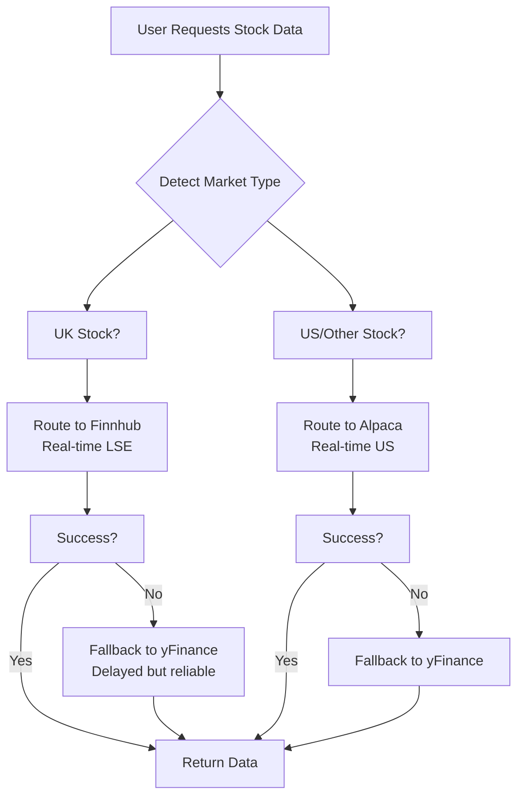

# Finnhub UK Stock Integration Plan

## Overview
Integrate Finnhub API as the primary data source for real-time UK stock charts, with intelligent routing between UK and US markets.

## Current Architecture Issues
- Alpaca doesn't support UK stocks (LSE)
- US stocks work with Alpaca, UK stocks fail with "possibly delisted"
- No fallback system for different market types

## Proposed Solution: Smart Multi-Source Routing

### Data Source Strategy


### Market Detection Logic
```python
def detect_market_type(ticker: str) -> str:
    """Determine if stock is UK, US, or other market"""
    # Check for explicit .L suffix (LSE)
    if ticker.upper().endswith('.L'):
        return 'uk'
    
    # Check if ticker is in known UK stock list
    uk_stocks = {'LLOY', 'BP', 'SHEL', 'HSBA', 'BARC', ...}  # FTSE 100 etc.
    if ticker.upper() in uk_stocks:
        return 'uk'
    
    # Check Trading212 patterns for UK stocks
    if '_EQ' in ticker.upper() and not '_US' in ticker.upper():
        return 'uk'
    
    # Default to US for unrecognized tickers
    return 'us'
```

## Implementation Phases

### Phase 1: Finnhub Client Setup
1. **Install Finnhub SDK**:
   ```bash
   pip install finnhub-python
   ```

2. **Create Finnhub client wrapper** in `data_engine.py`:
   ```python
   class FinnhubClient:
       def __init__(self):
           self.api_key = os.getenv('FINNHUB_API_KEY')
           if self.api_key:
               import finnhub
               self.client = finnhub.Client(api_key=self.api_key)
           else:
               self.client = None
   ```

3. **Add environment variable**:
   ```bash
   FINNHUB_API_KEY=your_api_key_here
   ```

### Phase 2: Market-Aware Data Routing with Real-Time Updates
1. **Update `get_chart_data()` function** in `additional_routes.py` with 5-second cache TTL:
   ```python
   @router.get("/api/chart/{symbol}")
   async def get_chart_data(symbol: str, timeframe: str = "1Day", limit: int = 500, provider: str = "auto"):
       # Auto-detect market and route accordingly
       if provider == "auto":
           market = detect_market_type(symbol)
           if market == "uk":
               provider = "finnhub"
           else:
               provider = "alpaca"
       
       # Route to appropriate provider
       if provider == "finnhub":
           return await get_finnhub_chart_data(symbol, timeframe, limit)
       elif provider == "alpaca":
           return await get_alpaca_chart_data(symbol, timeframe, limit)
       else:
           # Fallback to yFinance for any failures
           return await get_yfinance_chart_data(symbol, timeframe, limit)
   ```

2. **Create `get_finnhub_chart_data()` function**:
   ```python
   async def get_finnhub_chart_data(symbol: str, timeframe: str, limit: int):
       """Fetch chart data from Finnhub for UK stocks"""
       finnhub_client = get_finnhub_client()
       if not finnhub_client:
           # Fallback to yFinance if Finnhub not configured
           return await get_yfinance_chart_data(symbol, timeframe, limit)
       
       try:
           # Normalize ticker for LSE (.L suffix)
           normalized_symbol = normalize_ticker_for_lse(symbol)
           
           # Fetch candle data from Finnhub
           candles = finnhub_client.stock_candles(
               symbol=normalized_symbol,
               resolution=timeframe,
               count=limit
           )
           
           # Convert to our internal format
           return format_finnhub_data(candles)
           
       except Exception as e:
           logger.warning(f"Finnhub failed for {symbol}: {e}")
           # Fallback to yFinance
           return await get_yfinance_chart_data(symbol, timeframe, limit)
   ```

### Phase 3: LSE Ticker Normalization
1. **Create LSE-specific normalization**:
   ```python
   def normalize_ticker_for_lse(ticker: str) -> str:
       """Ensure UK tickers have proper .L suffix for LSE"""
       ticker = ticker.upper()
       
       # Remove any existing suffix
       if ticker.endswith('.L'):
           return ticker
       
       # Add .L for known UK stocks or if detected as UK
       if detect_market_type(ticker) == 'uk':
           return f"{ticker}.L"
       
       return ticker
   ```

2. **Update existing `normalize_ticker()` function** to be market-aware:
   ```python
   def normalize_ticker(ticker: str, target_market: str = None) -> str:
       """Enhanced ticker normalization with market awareness"""
       # Existing logic...
       
       # Market-specific adjustments
       if target_market == 'uk' and not ticker.endswith('.L'):
           if detect_market_type(ticker) == 'uk':
               ticker = f"{ticker}.L"
       
       return ticker.upper()
   ```

### Phase 4: Comprehensive Fallback System
1. **Implement cascading fallback logic**:
   ```python
   async def get_stock_data_with_fallback(symbol: str, primary_provider: str):
       """Try primary provider, then fallbacks"""
       providers = [primary_provider, "yfinance"]  # Add more as needed
       
       for provider in providers:
           try:
               if provider == "finnhub":
                   data = await get_finnhub_chart_data(symbol, timeframe, limit)
               elif provider == "alpaca":
                   data = await get_alpaca_chart_data(symbol, timeframe, limit)
               elif provider == "yfinance":
                   data = await get_yfinance_chart_data(symbol, timeframe, limit)
               
               if data and validate_data(data):
                   return data
                   
           except Exception as e:
               logger.warning(f"{provider} failed for {symbol}: {e}")
               continue
       
       raise Exception(f"All providers failed for {symbol}")
   ```

2. **Add data validation**:
   ```python
   def validate_data(data) -> bool:
       """Ensure returned data is valid and not empty"""
       if not data:
           return False
       
       # Check for required fields
       required_fields = ['symbol', 'data']
       if not all(field in data for field in required_fields):
           return False
       
       # Check if data array is not empty
       if not data.get('data'):
           return False
           
       return True
   ```

## Configuration & Setup

### Environment Variables Required
```bash
# Finnhub API (for UK stocks) - USER HAS KEY READY
FINNHUB_API_KEY=user_has_api_key_ready

# Existing Alpaca (for US stocks)
ALPACA_API_KEY=your_alpaca_key
ALPACA_SECRET_KEY=your_alpaca_secret
ALPACA_BASE_URL=https://paper-api.alpaca.markets
```

### Real-Time Update Configuration
**User Preference**: 5-second refresh intervals for live UK stock data
- **Finnhub WebSocket**: Real-time streaming for active trading
- **Frontend Polling**: 5-second intervals for chart updates
- **Backend Caching**: 5-second cache TTL to balance real-time vs API limits

### Dependencies to Add
```txt
# requirements.txt additions
finnhub-python>=2.0.0
```

## Testing Strategy

### Unit Tests
1. **Market Detection**:
   ```python
   assert detect_market_type("LLOY") == "uk"
   assert detect_market_type("AAPL") == "us"
   assert detect_market_type("LLOY.L") == "uk"
   ```

2. **Ticker Normalization**:
   ```python
   assert normalize_ticker_for_lse("LLOY") == "LLOY.L"
   assert normalize_ticker_for_lse("AAPL") == "AAPL"
   ```

### Integration Tests
1. **Finnhub API**:
   - Test UK stock data retrieval
   - Verify WebSocket real-time updates
   - Test rate limiting and error handling

2. **Fallback System**:
   - Simulate Finnhub failure → verify yFinance fallback
   - Test invalid tickers → graceful error handling

### End-to-End Tests
1. **UK Stock Charts**: Request LLOY.L chart → verify real-time data
2. **US Stock Charts**: Request AAPL chart → verify Alpaca still works
3. **Automatic Routing**: Request mixed UK/US stocks → verify correct provider selection

## Migration Plan

### Phase 1: Parallel Implementation
- Add Finnhub client alongside existing Alpaca client
- Implement market detection and routing logic
- Test with non-production traffic

### Phase 2: Gradual Rollout
- Enable Finnhub for UK stocks only
- Monitor error rates and performance
- Keep Alpaca as fallback for all requests

### Phase 3: Full Migration
- Switch all UK requests to Finnhub primary
- Optimize caching and rate limiting
- Remove Alpaca dependency for UK markets

## Monitoring & Maintenance

### Key Metrics to Track (5-Second Real-Time Focus)
- **API Response Times**: Finnhub WebSocket streaming performance
- **Update Frequency**: 5-second refresh interval compliance
- **Data Freshness**: Real-time LSE data accuracy vs. delayed fallbacks
- **Rate Limit Usage**: Monitor 60/min Finnhub limit with 5-second polling
- **WebSocket Stability**: Finnhub streaming connection reliability
- **Cache Hit Rates**: Balance real-time needs with API efficiency

### Alerting & Logging
- Monitor for API key expiration
- Track provider failures and automatic fallbacks
- Log market detection accuracy for continuous improvement

## Risk Assessment & Mitigation

### Low Risk Elements
- ✅ Finnhub free tier sufficient for retail use
- ✅ Fallback system prevents complete failures
- ✅ Market detection can be refined over time
- ✅ Existing US functionality unchanged

### Potential Issues & Solutions
1. **Rate Limiting**: Implement intelligent caching (5-15 min intervals)
2. **API Changes**: Abstract client interfaces for easy provider switching
3. **Data Format Differences**: Normalize all responses to consistent format
4. **Cost Management**: Monitor usage and implement tier-appropriate limits

## Success Criteria

✅ **UK stocks load real-time charts** from Finnhub with 5-second updates
✅ **US stocks continue working** with Alpaca (no regression)
✅ **WebSocket streaming** provides live LSE data updates
✅ **Automatic provider selection** routes correctly by market
✅ **Robust fallback system** ensures data availability
✅ **5-second refresh performance** meets real-time trading requirements
✅ **Rate limit compliance** within Finnhub 60/min free tier
✅ **Error rates below 5%** across all providers

This comprehensive plan provides real-time UK stock data while maintaining US market functionality and implementing a resilient multi-source architecture.</content>
<parameter name="filePath">/Users/sanketmane/Codes/Growin App/.opencode/plans/finnhub-uk-integration-plan.md