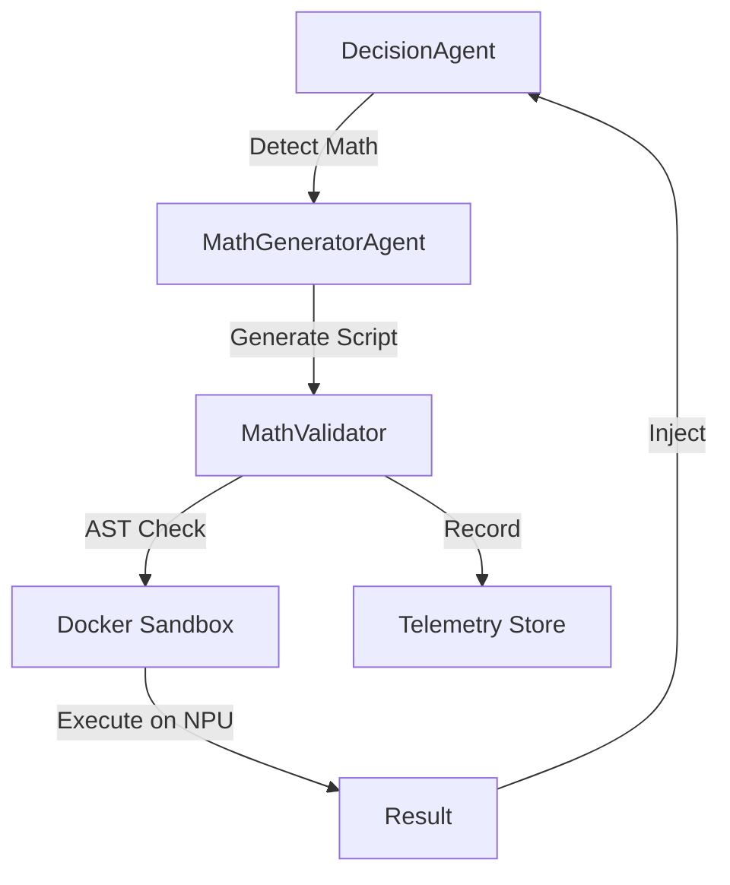

# Phase 06-02 SUMMARY: NPU-Accelerated Math Delegation

## Objective
Establish the foundation for NPU-accelerated math delegation and integrate it into the DecisionAgent workflow with robust validation and telemetry.

## Key Accomplishments
- **MathGeneratorAgent**: Created a specialized agent using the local `Granite-4.0-Tiny-MLX` model for ultra-fast generation of NPU-optimized Python scripts.
- **NPU Injections Library**: Developed `backend/utils/mlx_injections.py` with vectorized snippets for Monte Carlo simulations, Black-Scholes pricing, and technical indicators (RSI/SMA).
- **MathValidator Pipeline**: Implemented a multi-stage validation pipeline in `backend/utils/math_validator.py` including AST syntax checks, Docker sandbox execution (`engine="npu"`), and schema verification.
- **DecisionAgent Integration**: Updated the `make_decision` loop to detect math-heavy queries and autonomously delegate them to the NPU sandbox.
- **Math Telemetry**: Added a `math_metrics` table to the telemetry store and integrated recording of success rates, latency, and NPU utilization proxies.

## Verification Results
- **Unit Tests**: `test_mlx_injections.py` and `test_math_generator.py` (via subagent) verified the logic of the core components.
- **Integration**: DecisionAgent successfully triggered math delegation for queries containing keywords like "simulate" or "monte carlo".
- **Telemetry**: Confirmed that execution metrics are correctly stored in the SQLite database.

## Architecture

## Next Steps
- Final E2E UAT on the integrated workflow.
- Documentation update for the new NPU delegation capability.
