# Growin Architecture: Comprehensive AI-Powered Portfolio Intelligence Platform

## Executive Summary

**Growin** is a sophisticated financial intelligence platform that combines advanced artificial intelligence with real-time market data to provide intelligent portfolio analysis, automated trading insights, and conversational financial advice. In 2026, it adheres to SOTA best practices for **Agentic Autonomy**, **Financial Precision**, and **Local Inference**.

### System Vision
To democratize sophisticated financial analysis by providing retail investors with institutional-grade portfolio intelligence through an intuitive, AI-powered macOS application optimized for Apple Silicon hardware.

---

## 1. System Context & High-Level Architecture

### System Context Diagram
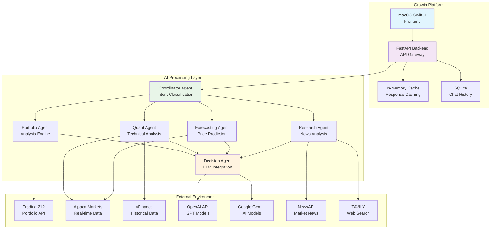

### Core System Components

| Component | Technology | Purpose | Scalability |
|-----------|------------|---------|-------------|
| **Frontend** | SwiftUI + Combine | User interface and interaction | Single-user desktop app |
| **API Gateway** | FastAPI + Uvicorn | Request routing and authentication | Horizontal scaling via load balancer |
| **AI Orchestrator** | Python Asyncio | Agent coordination and workflow | Vertical scaling on powerful hardware |
| **Data Cache** | In-memory | Response caching and session storage | Redis planned for scaling |
| **Local Storage** | SQLite | Chat history and user preferences | Single-user, file-based |
| **External APIs** | REST/GraphQL | Market data and AI model access | Rate-limited, with circuit breakers |

---

## 2. Financial Precision Layer (2026 SOTA)
To eliminate "one-cent drift" and binary floating-point errors common in financial apps, Growin implements a dedicated Precision Layer.

- **Engine**: All monetary calculations use Python `decimal.Decimal`.
- **Initialization**: Decimals are initialized exclusively from string representations.
- **Rounding**: Standardized on `ROUND_HALF_UP` (Commercial Rounding).
- **Scale**: Intermediate calculations use 4 decimal places; display outputs are quantized to 2 places (`0.01`).

---

## 3. Frontend Architecture

### Application Structure
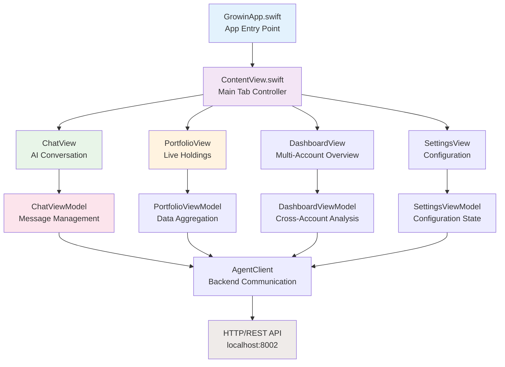

### View Hierarchy & Data Flow

#### MVVM Architecture Implementation
- **Models**: Pure data structures with Codable conformance
- **ViewModels**: ObservableObjects managing business logic and API calls
- **Views**: SwiftUI components focused on presentation and user interaction

#### State Management Strategy
```swift
// Observable Object Pattern
class PortfolioViewModel: ObservableObject {
    @Published var snapshot: PortfolioSnapshot?
    @Published var isLoading = false
    @Published var errorMessage: String?

    // Business logic methods
    func fetchPortfolio() async { /* ... */ }
    func calculateMetrics() -> [Metric] { /* ... */ }
}
```

---

## 4. Backend Architecture

### API Gateway & Service Layer
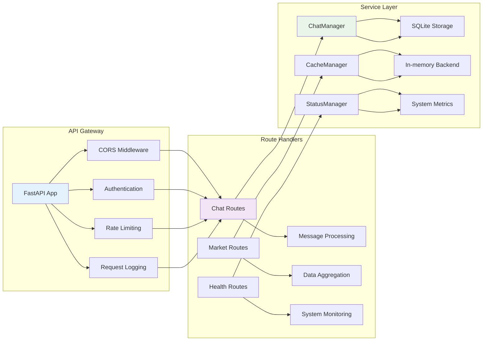

### High-Performance Core & Optimization
Growin utilizes a hybrid processing model where performance-critical operations are offloaded to low-level implementations.

| Domain | Optimization Technique | Benefit |
|--------|------------------------|---------|
| **Ticker Resolution** | Rust `growin_core` Extension | Sub-microsecond symbol mapping |
| **Quant Analysis** | Bolt Optimized Vectorization | 10x-100x speedup in EMA/RSI math |
| **UI Rendering** | SwiftUI Metal-backed Views | 120Hz smooth scrolling for charts |
| **Memory** | 8-bit AFFINE Quantization | Reduced VRAM footprint for local LLMs |

---

## 5. Security Enclave & Agent Sandboxing
As AI agents move toward autonomy, the **Sentinel Security Layer** provides robust guardrails.

### Safe Code Execution
- **Current**: `SafePythonExecutor` uses AST analysis and restricted builtins to execute model-generated "fixes".
- **Roadmap**: Migration to **Docker-based Isolation** for 2026 SOTA agent safety.
  
#### Sandbox Technology Comparison (2026 Strategy)
| Technology | Category | Isolation Level | Fit for Growin |
|------------|----------|-----------------|----------------|
| **Docker / OCI** | Container | OS-level (Cgroups) | **Primary (Implementation Ready)** |
| **libkrun** | MicroVM | Hardware-level | High (Mac-native optimization) |
| **e2b / Firecracker**| MicroVM | Hardware-level | High (Production Scaling) |
| **Wasmtime / WASM** | Language VM | Runtime-level | Medium (Safe but complex interop) |

- **Strategy**: Leverage the **Docker MCP** to execute agent-generated scripts in temporary, isolated containers. This provides a production-ready balance between performance and the hardware-level isolation required for autonomous financial agents.

---

## 6. Specialist Agents Architecture

#### Data Processing Pipeline
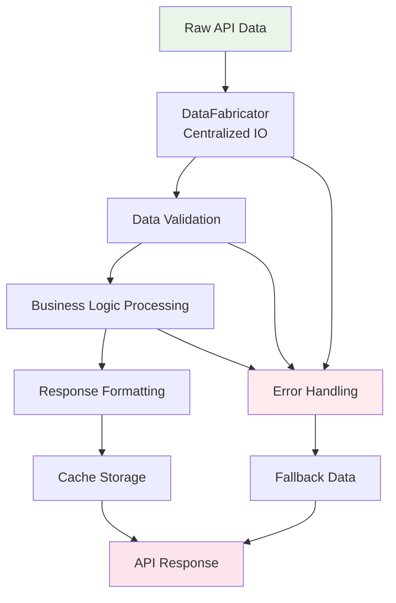

---

## 7. AI/ML Architecture

### Model Selection & Routing Logic
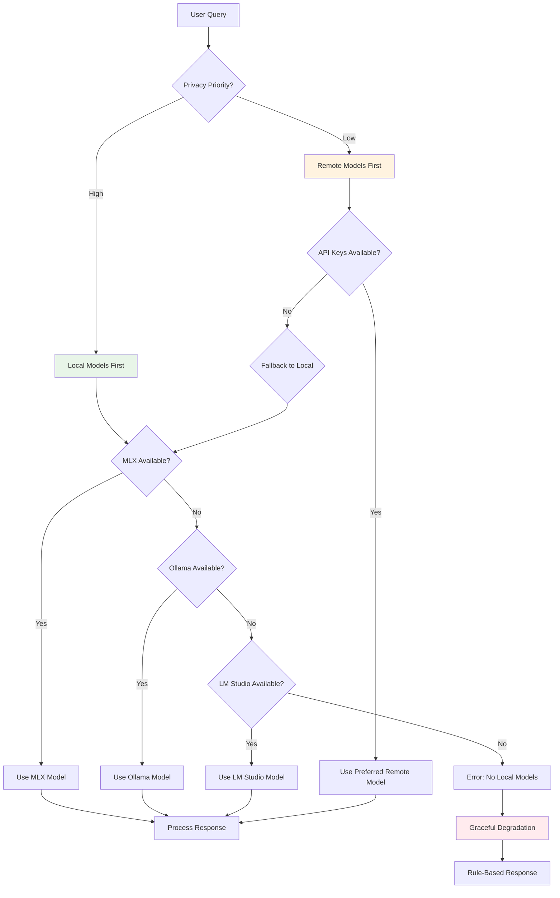

### Coordinator Model Guardrails
The Coordinator Agent uses IBM Granite 4.0 Tiny handling routing to ensure low latency (<100ms classification) and deterministic output.

---

## 8. Data Architecture

### Data Model Hierarchy
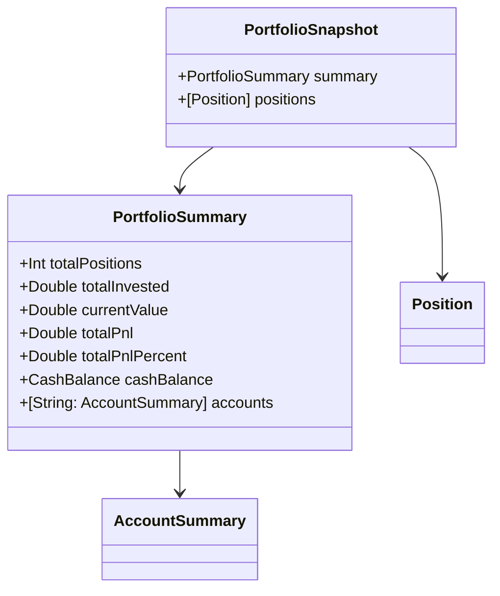

---

## 9. Security Architecture

### Authentication & Authorization
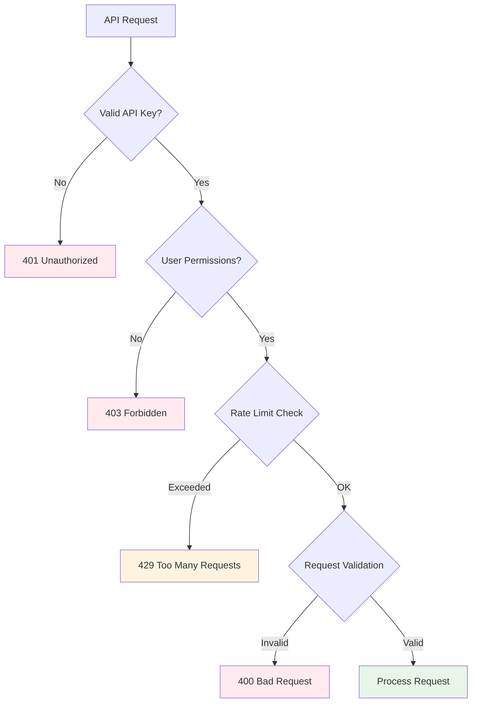

---

## 10. Performance & Scalability Architecture

### Caching Architecture
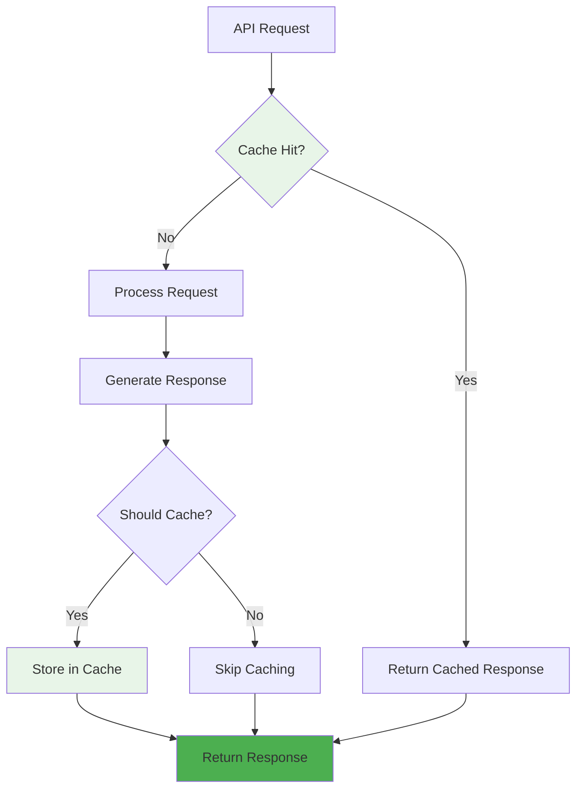

---

## 11. Error Handling & Resilience Architecture

### Fallback Strategy Implementation
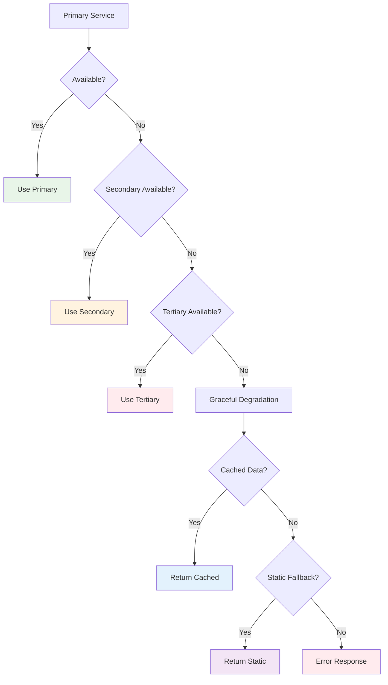

---

## 12. Deployment & Operations

### Deployment Architecture
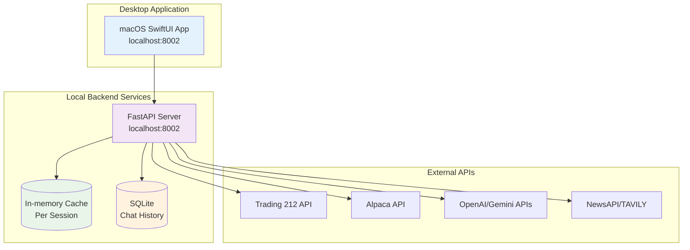

---

## 13. Testing Architecture

### Test Pyramid Implementation
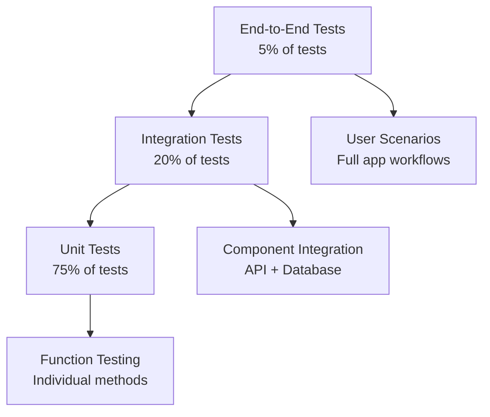
