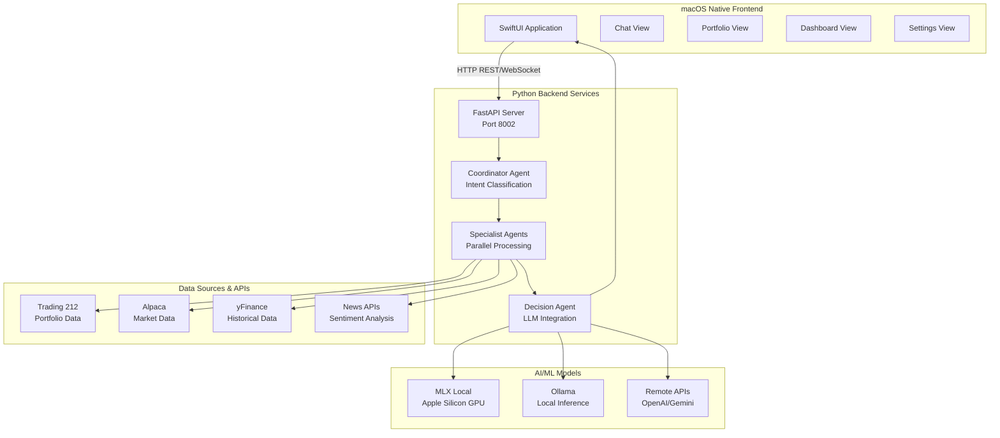
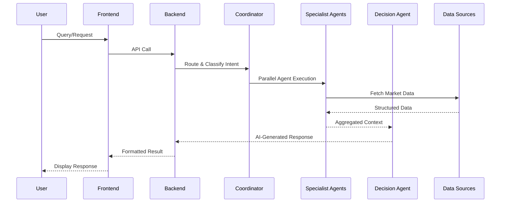
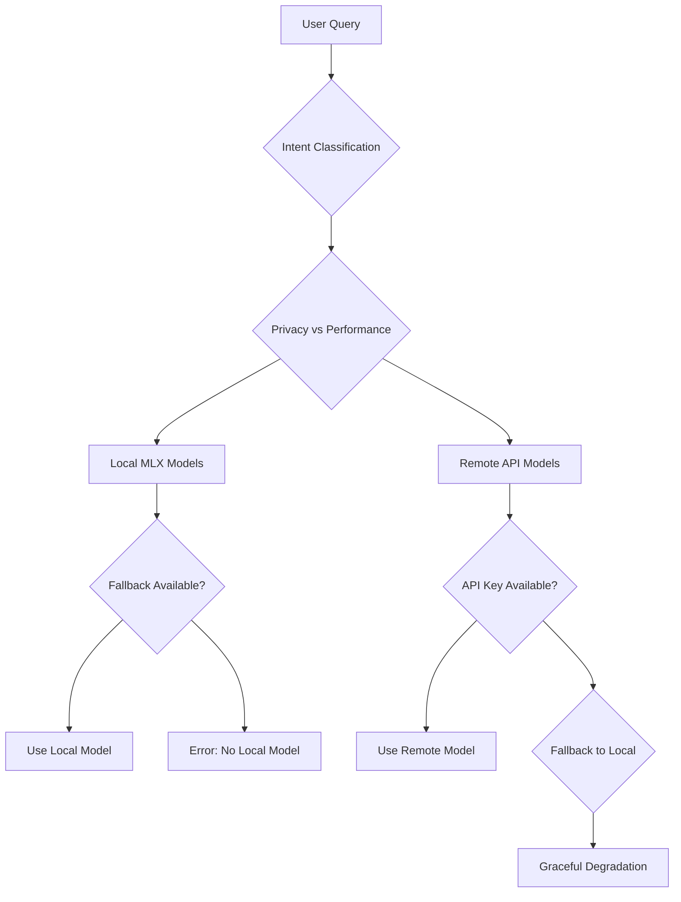

# Growin - Comprehensive AI-Powered Portfolio Intelligence Platform

**Growin** is a sophisticated, native macOS application that combines advanced AI capabilities with real-time financial data to provide intelligent portfolio analysis, automated trading insights, and conversational financial advice. Built specifically for Apple Silicon, it leverages local LLMs and optimized algorithms for privacy-focused, high-performance financial intelligence.

[](https://developer.apple.com/macos/)
[](https://developer.apple.com/xcode/swiftui/)
[](https://www.python.org/)
[](https://fastapi.tiangolo.com/)

## 🏗️ System Architecture

Growin implements a **hybrid algorithmic-LLM architecture** that combines structured quantitative analysis with advanced AI reasoning. High-performance paths are accelerated via a **Rust Native Core** and **Vectorized Python Agents**.

### Key SOTA Features (2026)
- **💎 Financial Precision Layer**: Eliminates binary float errors using string-initialized `Decimal` arithmetic.
- **🚀 Bolt-Optimized Quant Engine**: Rust-accelerated technical analysis (EMA, RSI) with MLX-optimized inference.
- **🛡️ Sentinel Security Enclave**: AST-validated Python sandboxing with log-masking for agent safety.
- **⚙️ Hybrid Ticker Engine**: High-speed Rust symbol normalization with global exchange heuristics.
- **🎨 Palette UI System**: Accessible, 120Hz smooth interface with glassmorphism and native macOS traits.
### High-Level System Overview


### Data Flow Architecture


## 🚀 Comprehensive Setup Guide

### Prerequisites & System Requirements

#### Hardware Requirements
- **macOS Version**: 13.0+ (Ventura) or 14.0+ (Sonoma) - Apple Silicon required
- **Processor**: Apple Silicon (M1/M2/M3/M4) - **Optimized for M4 Pro with 48GB Unified Memory**
- **RAM**: Minimum 16GB, Recommended 32GB+ for MLX models
- **Storage**: 15GB+ free space for models and data (Granite-Tiny ~7.4GB)
- **Network**: Stable internet for API calls and model downloads

#### Software Dependencies
```bash
# Required System Packages
brew install python@3.11 git

# Optional: Local LLM Providers
brew install ollama          # For Ollama models
# LM Studio: Download from lmstudio.ai

# Development Tools
brew install redis           # For caching (optional)
```

#### API Keys Required
| Service | Purpose | Where to Get | Cost |
|---------|---------|--------------|------|
| **Trading 212** | Portfolio data | [trading212.com/api](https://trading212.com/api) | Free/Paid |
| **OpenAI** | GPT models | [platform.openai.com](https://platform.openai.com/api-keys) | Pay-per-use |
| **Google Gemini** | Gemini models | [aistudio.google.com](https://aistudio.google.com/app/apikey) | Free tier available |
| **NewsAPI** | Market news | [newsapi.org](https://newsapi.org) | Free tier available |
| **TAVILY** | Web search | [tavily.com](https://tavily.com) | Free tier available |

### Step-by-Step Installation

#### 1. Clone and Prepare Repository
```bash
# Clone the repository
git clone https://github.com/your-org/growin.git
cd growin

# Ensure correct Python version
python3.11 --version  # Should be 3.11.x

# Create virtual environment
python3.11 -m venv backend/.venv
source backend/.venv/bin/activate
```

#### 2. Backend Setup & Dependencies
```bash
# Install Python dependencies
pip install -r backend/requirements.txt

# Optional: Install TA-Lib (technical analysis)
# Note: TA-Lib has C dependencies, may require additional setup
pip install TA-Lib

# Optional: Install Redis for future scaling (currently uses in-memory caching)
brew install redis
brew services start redis
```

#### 3. Configure Environment Variables
```bash
# Create environment file
cp backend/.env.example backend/.env

# Edit with your API keys
nano backend/.env
```

**Required Environment Variables:**
```bash
# Trading 212 API (Required for portfolio)
T212_INVEST_KEY=your_invest_api_key
T212_INVEST_SECRET=your_invest_secret
T212_ISA_KEY=your_isa_api_key
T212_ISA_SECRET=your_isa_secret

# LLM Providers (Choose at least one)
OPENAI_API_KEY=your_openai_key
GEMINI_API_KEY=your_gemini_key

# Optional: Additional services
NEWSAPI_KEY=your_newsapi_key
TAVILY_API_KEY=your_tavily_key

# Application Settings
DEBUG=true
REDIS_URL=redis://localhost:6379
```

#### 4. Local LLM Setup (Recommended for Privacy)

**Option A: MLX Models (Apple Silicon GPU)**
```bash
# MLX is automatically configured via requirements.txt
# Models are downloaded on first use
```

**Option B: Ollama Setup**
```bash
# Install Ollama
brew install ollama

# Start Ollama service
brew services start ollama

# Pull recommended models
ollama pull mistral:7b-instruct-q4_0
ollama pull llama3:8b-instruct-q4_0
```

**Option C: LM Studio Setup**
```bash
# Download from: https://lmstudio.ai/
# Load any GGUF model (Mistral, Llama, etc.)
# Enable Metal GPU acceleration in settings
# Server will be available at http://localhost:1234
```

#### 5. Start Backend Services
```bash
# Use the simplified startup script
./run

# This handles environment setup, dependencies, and server launch automatically.

```

**Verify Backend is Running:**
```bash
# Check if server is responding
curl http://localhost:8002/health

# Should return: {"status": "healthy"}
```

#### 6. Frontend Setup & Build
```bash
# Open Xcode project
open Growin/Growin.xcodeproj

# In Xcode:
# 1. Select "Growin" target
# 2. Choose your Apple Silicon device/simulator
# 3. Press Cmd+R to build and run

# Alternative: Command line build
xcodebuild -project Growin/Growin.xcodeproj -scheme Growin -sdk macosx -configuration Debug
```

### Configuration & Model Selection

#### AI Model Configuration
Navigate to **Settings Tab** in the app:

**Local Models (Privacy-First):**
- **MLX**: `granite-tiny` (routing), `mistral-7b`, `llama-3-8b`
- **Ollama**: `mistral`, `llama3`, `gemma`
- **LM Studio**: Any loaded GGUF model

**Remote Models (Advanced Features):**
- **OpenAI**: `gpt-4o` (recommended), `gpt-4-turbo`
- **Gemini**: `gemini-1.5-pro`, `gemini-1.5-flash`

#### Trading Account Setup
1. **Get API Keys**: Visit [trading212.com/api](https://trading212.com/api)
2. **Configure INVEST Account**: Enter key/secret in Settings
3. **Configure ISA Account**: Enter ISA key/secret (if applicable)
4. **Test Connection**: App will validate credentials on save

### Verification & Testing

#### Backend Health Check
```bash
# Health endpoint
curl http://localhost:8002/health

# API documentation
open http://localhost:8002/docs

# Test portfolio endpoint
curl "http://localhost:8002/portfolio/live"
```

#### Frontend Testing
1. **Launch App**: Should connect to backend automatically
2. **Test Chat**: Ask "What's in my portfolio?" - should respond with data
3. **Test Portfolio**: Should show live positions and P&L
4. **Test Settings**: Model switching should work without errors

#### Common Setup Issues & Solutions

**Backend Won't Start:**
```bash
# Check Python version
python3.11 --version

# Verify virtual environment
source backend/.venv/bin/activate
which python  # Should point to .venv

# Check dependencies
pip list | grep fastapi
pip list | grep mlx
```

**App Shows "Backend Offline":**
```bash
# Verify backend is running
ps aux | grep uvicorn

# Check port availability
lsof -i :8002

# Test connectivity
curl http://localhost:8002/health
```

**MLX Model Loading Issues:**
```bash
# Check Metal GPU availability
system_profiler SPDisplaysDataType | grep Metal

# Verify MLX installation
python -c "import mlx; print('MLX available')"

# Clear model cache if needed
rm -rf ~/Library/Caches/mlx/
```

**API Key Validation:**
```bash
# Test Trading 212 connection
curl -H "Authorization: Bearer YOUR_KEY" https://live.trading212.com/api/v0/equity/portfolio

# Test OpenAI key
curl -H "Authorization: Bearer YOUR_KEY" https://api.openai.com/v1/models
```

## 🚀 Core Features & Capabilities

### 🤖 Intelligent Chat System
**Multi-Agent AI Conversation Engine**
- **Real-time Portfolio Analysis**: Conversational queries about holdings, performance, and strategy
- **Agent Orchestration**: Coordinator + 4 specialist agents (Portfolio, Quant, Forecast, Research)
- **Contextual Responses**: Responses tailored to user's specific account data and market conditions
- **Conversation Management**: Persistent chat history with bulk operations (select all, delete all)
- **Fallback Handling**: Graceful degradation when AI services are unavailable

**Technical Implementation:**
- **Intent Classification**: Granite-tiny model for query routing (<50ms)
- **Parallel Processing**: Async execution of multiple analysis agents
- **Response Generation**: User-selected LLM (GPT-4o, Claude, or local MLX models)
- **Error Recovery**: Automatic retry logic with exponential backoff

### 📊 Advanced Portfolio Intelligence
**Real-Time Multi-Account Tracking**
- **Dual Account Support**: INVEST and ISA account separation with individual metrics
- **Live Data Integration**: Trading 212 API with automatic position updates
- **Performance Analytics**: Real-time P&L, returns, and risk metrics
- **Historical Charts**: Interactive time-series visualization (1D to 5Y)
- **Currency Handling**: Automatic GBX→GBP conversion with fallback detection

**Data Processing Features:**
- **Position Normalization**: Automatic currency conversion (GBX→GBP, USD→GBP)
- **P&L Calculation**: Real-time profit/loss across all positions
- **Allocation Analysis**: Sector and asset distribution charts
- **Performance Attribution**: Individual position contribution tracking

### 📈 AI-Powered Market Analysis
**Quantitative + AI Forecasting**
- **Technical Indicators**: RSI, MACD, Bollinger Bands, Support/Resistance (TA-Lib)
- **Price Forecasting**: 24h, 48h, 7-day predictions using TTM-R2 transformer model
- **Sentiment Analysis**: News headline processing with confidence scoring
- **Market Intelligence**: Real-time data from Alpaca and yFinance APIs

**Algorithmic Capabilities:**
- **Signal Generation**: BUY/SELL/NEUTRAL recommendations based on technical analysis
- **Risk Assessment**: Position sizing and diversification analysis
- **Correlation Analysis**: Asset relationship modeling
- **Volatility Measurement**: Historical and implied volatility calculations

### ⚙️ Comprehensive Settings & Configuration
**Multi-Provider AI Integration**
- **Local Models**: MLX (Apple Silicon GPU), Ollama, LM Studio
- **Remote APIs**: OpenAI GPT-4o, Google Gemini, Anthropic Claude
- **Model Selection**: Dynamic switching with performance metrics
- **API Management**: Secure credential storage with encryption

**Trading Platform Integration:**
- **Trading 212**: INVEST and ISA account configuration
- **Alpaca**: Alternative market data provider
- **MCP Servers**: Model Context Protocol for standardized integrations

### 🔧 Advanced Technical Features
**Performance Optimizations:**
- **Apple Silicon Acceleration**: MLX models with Metal GPU optimization
- **Async Processing**: Full async/await implementation throughout backend
- **Response Caching**: 60-second TTL with in-memory caching (Redis for future scaling)
- **Lazy Loading**: On-demand model initialization and data fetching

**Reliability Features:**
- **Connection Pooling**: Optimized HTTP client management
- **Circuit Breakers**: Automatic failure detection and recovery
- **Graceful Degradation**: Continued operation during partial service outages
- **Comprehensive Logging**: Structured logging with correlation IDs

## 🛠️ Complete Technology Stack

### Frontend (macOS Native Application)
**Core Framework:**
- **SwiftUI 5.0+**: Declarative UI with modern concurrency (async/await)
- **Swift 5.9+**: Native language with advanced generics and concurrency
- **Xcode 15.0+**: IDE with integrated SwiftUI preview and debugging

**UI & Visualization Libraries:**
- **Charts**: Apple's native charting framework for interactive financial graphs
- **Combine**: Reactive programming for real-time data streams
- **Core Data**: Local data persistence with CloudKit sync capabilities

**Networking & Communication:**
- **URLSession**: Native HTTP client with background session support
- **WebSocket**: Real-time communication with backend services
- **Network**: Modern networking framework with automatic retry logic

### Backend (Python AI Services)
**Core Framework:**
- **Python 3.11+**: Latest stable version with advanced async features
- **FastAPI**: High-performance async web framework with automatic OpenAPI generation
- **Uvicorn**: ASGI server optimized for async applications
- **Pydantic**: Data validation and serialization with type hints

**AI/ML Libraries:**
- **MLX**: Apple's Metal-accelerated ML framework for Apple Silicon
- **mlx-lm**: Large language model inference on Apple Silicon GPU
- **Transformers**: Hugging Face library for model loading and tokenization
- **TA-Lib**: Technical analysis library (RSI, MACD, Bollinger Bands)
- **Scikit-learn**: Machine learning algorithms for forecasting
- **PyTorch**: Deep learning framework for custom models

**Data Processing & Analysis:**
- **Pandas**: Data manipulation and time-series analysis
- **NumPy**: Numerical computing with vectorized operations
- **yFinance**: Yahoo Finance API client for historical data
- **alpaca-py**: Alpaca Markets API client for real-time data
- **trading212-api**: Custom Trading 212 integration

**External API Integrations:**
- **OpenAI API**: GPT-4o, GPT-4-turbo for advanced reasoning
- **Google Gemini API**: Gemini-1.5-pro for multimodal analysis
- **Anthropic Claude API**: Claude-3 for nuanced financial advice
- **NewsAPI**: Real-time news and sentiment analysis
- **TAVILY API**: Web search and research capabilities

### Database & Caching
**Primary Storage:**
- **SQLite**: Embedded database (`growin.db`) for conversation history and user preferences
- **In-memory Cache**: High-performance caching for API responses (60s TTL)

**Data Serialization:**
- **JSON**: Standard data interchange format
- **MessagePack**: Efficient binary serialization for internal communication
- **Pickle**: Python object serialization for ML model caching

### DevOps & Deployment
**Containerization:**
- **Docker**: Containerized deployment for backend services
- **Docker Compose**: Multi-service orchestration for development

**Monitoring & Observability:**
- **Prometheus**: Metrics collection and alerting
- **Grafana**: Dashboard visualization for system monitoring
- **Structured Logging**: JSON-formatted logs with correlation IDs

## 🤖 AI Models & Capabilities

### Local Models (Privacy-Focused)
**MLX Models (Apple Silicon GPU):**
- **Granite-Tiny (Coordinator)**: IBM Granite 4.0 Tiny 8-bit MoE Hybrid (~7.4GB)
  - Architecture: `GraniteMoeHybridForCausalLM` (Mamba-Attention hybrid with 64 MoE experts)
  - 40 layers, 1536 hidden size, 131K context window
  - Guardrails: Temperature=0, Top-p=1.0, Strict JSON output enforcement
  - Role: Intent classification and agent routing (<100ms inference)
- **LFM2.5-1.2B (Decision Agent)**: Lightweight local reasoning model
- **Mistral-7B**: General-purpose reasoning with financial knowledge
- **Quantization**: 8-bit optimization for memory efficiency

**Ollama Models:**
- **Mistral**: Balanced performance for conversational AI
- **Llama 3**: Latest generation with improved reasoning
- **Gemma**: Google's lightweight model for efficiency

**LM Studio Integration:**
- **Dynamic Model Loading**: Load any GGUF model at runtime
- **GPU Acceleration**: Metal API integration for Apple Silicon
- **Local API**: RESTful interface for seamless integration

### Remote Models (Advanced Capabilities)
**OpenAI GPT Series:**
- **GPT-4o**: Multimodal reasoning with real-time analysis
- **GPT-4-turbo**: Cost-effective high-performance model
- **Token Optimization**: Efficient prompt engineering for financial queries

**Google Gemini:**
- **Gemini-1.5-pro**: Advanced multimodal capabilities
- **Flash Models**: Fast inference for real-time responses
- **Safety Features**: Built-in content moderation and fact-checking

### Model Selection Strategy


## 🛡️ Fallback Mechanisms & Error Handling

### AI Service Fallbacks
**Primary → Secondary → Tertiary Progression:**

1. **Preferred Model**: User's selected primary model
2. **Backup Model**: Automatic failover to alternative in same category
3. **Offline Mode**: Rule-based responses without AI
4. **Error State**: Clear user communication with retry options

**Specific Fallback Scenarios:**
- **Network Failure**: Cached responses with timestamp indicators
- **API Rate Limits**: Exponential backoff with user notifications
- **Model Unavailable**: Automatic switching to available alternatives
- **GPU Memory Issues**: Fallback to CPU inference or smaller models

### Data Source Fallbacks
**Market Data Resilience:**
- **Primary**: Trading 212 API for portfolio data
- **Secondary**: Alpaca API for market data and positions
- **Tertiary**: yFinance for historical data and basic quotes
- **Offline**: Cached data with staleness indicators

**News & Research Fallbacks:**
- **Primary**: NewsAPI for real-time sentiment
- **Secondary**: TAVILY for web search and research
- **Tertiary**: Cached historical analysis
- **Offline**: Generic market insights without fresh data

### Edge Cases & Error Scenarios

#### Happy Path Scenarios ✅
- **New User Onboarding**: Smooth first-time setup with guided configuration
- **Stable Network**: Real-time updates with sub-second latency
- **Complete Data**: All APIs responding with full dataset
- **Model Availability**: All preferred models loaded and responsive

#### Error Scenarios & Recovery 🔄
- **API Key Missing**: Clear error messages with setup instructions
- **Network Interruption**: Automatic retry with progressive backoff
- **Partial Data Loss**: Continue operation with available data + warnings
- **Model Loading Failure**: Fallback model activation with user notification

#### Edge Cases Handled ⚠️
- **Empty Portfolio**: Graceful "no data" states with helpful guidance
- **Invalid Tickers**: Symbol validation with suggestions
- **Currency Mismatches**: Automatic conversion with exchange rate handling
- **Concurrent Requests**: Request queuing and rate limiting
- **Large Datasets**: Pagination and progressive loading
- **Memory Constraints**: Model quantization and selective caching

### Performance Optimizations

#### Apple Silicon Optimizations
```swift
// MLX GPU Acceleration
let model = try await MLXLM.loadModel("granite-tiny")
let tokens = tokenizer.encode(query)
let output = try await model.generate(tokens, maxTokens: 512)
// Native Metal GPU utilization
```

**Key Optimizations:**
- **Unified Memory**: Zero-copy data transfer between CPU/GPU
- **Metal Shaders**: Custom compute kernels for financial calculations
- **Memory Pooling**: Efficient VRAM management for multiple models
- **Lazy Loading**: On-demand model initialization

#### Backend Performance Features
- **Async Processing**: Non-blocking I/O operations throughout
- **Connection Pooling**: Optimized HTTP client reuse and keep-alive
- **Response Caching**: In-memory caching with TTL (Redis planned for future scaling)
- **Batch Processing**: Parallel API calls with asyncio.gather()
- **Memory Management**: Automatic cleanup and garbage collection

#### Frontend Performance Features
- **Lazy Loading**: Views loaded on-demand
- **Background Refresh**: Non-blocking data updates
- **Memory Efficient**: Automatic view recycling
- **Network Efficient**: Request deduplication and compression

## 📡 API Reference & Integration

### Backend API Endpoints

#### Core Portfolio Endpoints
```http
GET /portfolio/live?account_type={invest|isa|all}
```
**Response:** Complete portfolio data with positions, summary, and accounts
```json
{
  "summary": {
    "total_positions": 44,
    "total_invested": 1116.39,
    "current_value": 1286.28,
    "total_pnl": 165.32,
    "total_pnl_percent": 14.81,
    "cash_balance": {"total": 1737.34, "free": 444.19},
    "accounts": {
      "invest": {/* account summary */},
      "isa": {/* account summary */}
    }
  },
  "positions": [
    {
      "ticker": "AAPL",
      "quantity": 10.5,
      "currentPrice": 150.25,
      "averagePrice": 145.80,
      "ppl": 47.25,
      "account_type": "invest"
    }
  ]
}
```

#### Market Analysis Endpoints
```http
GET /market/analysis?ticker=AAPL&timeframe=1D
POST /market/forecast?ticker=AAPL&horizon=24h
GET /market/news?query=technology&limit=10
```

#### Chat & AI Endpoints
```http
POST /api/chat/message
Content-Type: application/json

{
  "message": "What's my portfolio performance?",
  "conversation_id": "conv_123",
  "model_name": "gpt-4o",
  "account_type": "all"
}
```

#### Conversation Management
```http
GET /conversations                    # List all conversations
GET /conversations/{id}              # Get specific conversation
DELETE /conversations/{id}           # Delete conversation
POST /conversations/{id}/clear       # Clear conversation messages
```

### Rate Limits & Quotas

| Service | Rate Limit | Burst | Reset |
|---------|------------|-------|-------|
| Trading 212 | 100/min | 200 | 60s |
| OpenAI | 100/min | 200 | 60s |
| Gemini | 60/min | 120 | 60s |
| NewsAPI | 100/day | N/A | Daily |
| TAVILY | 100/day | N/A | Daily |

### Authentication & Security

#### API Key Management
- **Storage**: Encrypted in macOS Keychain
- **Validation**: Automatic credential verification
- **Rotation**: Manual key updates with validation
- **Fallback**: Graceful degradation when keys are invalid

#### Request Signing
```python
# Example API request with authentication
headers = {
    "Authorization": f"Bearer {api_key}",
    "Content-Type": "application/json"
}
```

#### Data Encryption
- **In Transit**: TLS 1.3 for all API communications
- **At Rest**: macOS Keychain encryption for stored credentials
- **Memory**: Automatic cleanup of sensitive data

## 📁 Complete Project Structure

```
Growin App/
├── README.md                          # This comprehensive guide
├── ARCHITECTURE.md                    # Detailed technical documentation
├── start_backend.sh                   # Backend startup script
│
├── Growin/                           # macOS SwiftUI Frontend
│   ├── Growin.xcodeproj              # Xcode project file
│   └── Growin/                       # Source code
│       ├── App/                      # Application lifecycle
│       │   ├── GrowinApp.swift       # App entry point
│       │   └── AppDelegate.swift     # macOS delegate
│       │
│       ├── Views/                    # UI Components
│       │   ├── ContentView.swift     # Main tab container
│       │   ├── ChatView.swift        # AI conversation interface
│       │   ├── PortfolioView.swift   # Portfolio dashboard
│       │   ├── DashboardView.swift   # Multi-account overview
│       │   ├── SettingsView.swift    # Configuration panel
│       │   └── Shared/               # Reusable components
│       │       ├── GlassCard.swift   # Glass morphism UI
│       │       ├── MiniMetricCard.swift
│       │       └── PositionCard.swift
│       │
│       ├── ViewModels/               # Business logic
│       │   ├── ChatViewModel.swift   # Chat state management
│       │   ├── PortfolioViewModel.swift
│       │   ├── DashboardViewModel.swift
│       │   └── SettingsViewModel.swift
│       │
│       ├── Models/                   # Data structures
│       │   ├── PortfolioSnapshot.swift
│       │   ├── Position.swift
│       │   ├── ConversationItem.swift
│       │   └── SystemStatus.swift
│       │
│       ├── Services/                 # External integrations
│       │   ├── AgentClient.swift     # Backend communication
│       │   ├── CacheManager.swift    # Local caching
│       │   └── KeychainManager.swift # Secure storage
│       │
│       └── Resources/                # Assets & resources
│           ├── Assets.xcassets       # Images & colors
│           └── Info.plist            # App configuration
│
└── backend/                          # Python AI Backend
    ├── server.py                     # FastAPI application
    ├── requirements.txt              # Python dependencies
    ├── .env                          # Environment configuration
    │
    ├── routes/                       # API endpoints
    │   ├── __init__.py
    │   ├── chat_routes.py            # Chat & conversation APIs
    │   ├── market_routes.py          # Portfolio & market data
    │   ├── additional_routes.py      # Utility endpoints
    │   └── health_routes.py          # Health checks
    │
    ├── agents/                       # AI specialist agents
    │   ├── __init__.py
    │   ├── base_agent.py             # Common agent interface
    │   ├── portfolio_agent.py        # Portfolio analysis
    │   ├── quant_agent.py            # Technical analysis
    │   ├── forecasting_agent.py      # Price prediction
    │   ├── research_agent.py         # News & sentiment
    │   ├── social_agent.py           # Social media analysis
    │   └── whale_agent.py            # Large trader tracking
    │
    ├── coordinator_agent.py          # Agent orchestration
    ├── decision_agent.py             # LLM integration & reasoning
    │
    ├── market_context.py             # Data aggregation
    ├── cache_manager.py              # Response caching
    ├── status_manager.py             # System monitoring
    │
    ├── data_engine.py                # Data processing pipeline
    ├── price_validation.py           # Price accuracy checks
    ├── trading212_mcp_server.py     # Trading 212 integration
    │
    ├── currency_utils.py             # Currency normalization
    ├── quant_engine.py               # Quantitative calculations
    ├── forecaster.py                 # ML forecasting engine
    │
    ├── chat_manager.py               # Conversation persistence
    ├── tests/                        # Test suites
    │   ├── test_agents.py
    │   ├── test_forecaster.py
    │   └── test_chat.py
    │
    └── venv/                         # Virtual environment (created by start_backend.sh)
```

### File Organization Principles

#### Frontend (SwiftUI)
- **MVVM Pattern**: ViewModels handle business logic, Views are purely presentational
- **Protocol-Oriented**: Extensive use of protocols for testability and flexibility
- **Observable Objects**: Combine framework for reactive data binding
- **Error Boundaries**: Comprehensive error handling with user-friendly messages

#### Backend (Python)
- **Async First**: Full async/await implementation for scalability
- **Dependency Injection**: Clean architecture with injectable services
- **Repository Pattern**: Data access abstraction for testability
- **Middleware Stack**: Request logging, CORS, authentication, rate limiting

## 🔧 Development & Contribution

### Development Workflow
```bash
# 1. Fork and clone
git clone https://github.com/your-org/growin.git
cd growin

# 2. Set up development environment
./start_backend.sh  # Backend with hot reload
open Growin/Growin.xcodeproj  # Frontend

# 3. Create feature branch
git checkout -b feature/your-feature

# 4. Run tests
cd backend && python -m pytest
# Frontend: Cmd+U in Xcode

# 5. Submit PR
git push origin feature/your-feature
```

### Code Quality Standards

#### Swift Code Style
```swift
// ✅ Good: Clear naming, error handling, documentation
struct PortfolioView: View {
    @StateObject private var viewModel = PortfolioViewModel()

    var body: some View {
        VStack {
            if let snapshot = viewModel.snapshot {
                PortfolioContent(snapshot: snapshot)
            } else if viewModel.isLoading {
                ProgressView()
            } else if let error = viewModel.errorMessage {
                ErrorView(message: error)
            }
        }
        .task { await viewModel.fetchPortfolio() }
    }
}
```

#### Python Code Style
```python
# ✅ Good: Type hints, async, error handling
async def get_portfolio_data(account_type: str) -> PortfolioData:
    """
    Fetch portfolio data with comprehensive error handling.

    Args:
        account_type: Account to query (invest, isa, all)

    Returns:
        PortfolioData: Structured portfolio information

    Raises:
        HTTPException: For API errors or invalid data
    """
    try:
        data = await fetch_from_trading212(account_type)
        normalized = normalize_portfolio_data(data)
        return PortfolioData(**normalized)
    except Exception as e:
        logger.error(f"Portfolio fetch failed: {e}")
        raise HTTPException(status_code=500, detail=str(e))
```

### Testing Strategy

#### Backend Testing
```bash
# Run all tests
cd backend
python -m pytest tests/ -v --cov=.

# Run specific test suite
python -m pytest tests/test_agents.py

# Performance testing
python -m pytest tests/ --benchmark-only
```

#### Frontend Testing
```swift
// XCTest example
func testPortfolioViewModel() {
    let viewModel = PortfolioViewModel()
    XCTAssertNotNil(viewModel)

    // Test data loading
    let expectation = XCTestExpectation(description: "Portfolio loads")
    Task {
        await viewModel.fetchPortfolio()
        XCTAssertNotNil(viewModel.snapshot)
        expectation.fulfill()
    }
    wait(for: [expectation], timeout: 10.0)
}
```

### Performance Benchmarks

#### Target Metrics
- **Chat Response Time**: <3 seconds for AI-generated responses
- **Portfolio Load Time**: <1 second for cached data, <5 seconds for fresh
- **Memory Usage**: <500MB for typical usage scenarios
- **CPU Usage**: <30% during normal operation, <80% during AI processing

#### Monitoring Commands
```bash
# Backend performance
python -c "import psutil; print(f'CPU: {psutil.cpu_percent()}%, Memory: {psutil.virtual_memory().percent}%')"

# Frontend performance
# Xcode: Product > Profile > Time Profiler
```

## 🐛 Comprehensive Troubleshooting Guide

### Critical Issues

#### Backend Won't Start
**Symptoms:** Port 8002 not responding, "Connection refused" errors

**Solutions:**
```bash
# 1. Check Python environment
source backend/.venv/bin/activate
python --version  # Should be 3.11+

# 2. Verify dependencies
pip list | grep fastapi
pip list | grep uvicorn

# 3. Check for port conflicts
lsof -i :8002
kill -9 <PID>

# 4. Restart with debug logging
DEBUG=true python -m uvicorn server:app --host 0.0.0.0 --port 8002 --log-level debug
```

#### Frontend "Backend Offline" Error
**Symptoms:** App shows connection errors, red status indicators

**Debug Steps:**
```bash
# 1. Verify backend is running
curl http://localhost:8002/health

# 2. Check network permissions (macOS)
# System Settings > Privacy & Security > Local Network
# Ensure Growin.app is allowed

# 3. Test API endpoints
curl "http://localhost:8002/portfolio/live"

# 4. Check firewall settings
sudo pfctl -s info
```

### AI Model Issues

#### MLX Model Loading Failures
**Symptoms:** "Failed to load MLX model" errors

**Solutions:**
```bash
# 1. Verify Metal GPU support
system_profiler SPDisplaysDataType | grep Metal

# 2. Check available memory
vm_stat | grep "Pages free"

# 3. Clear model cache
rm -rf ~/Library/Caches/mlx/

# 4. Test basic MLX functionality
python -c "import mlx; import mlx.core as mx; print('MLX working')"
```

#### Ollama Connection Issues
**Symptoms:** "Ollama not responding" or model loading errors

**Fixes:**
```bash
# 1. Verify Ollama is running
brew services list | grep ollama

# 2. Check model availability
ollama list

# 3. Pull required models
ollama pull mistral:7b-instruct-q4_0

# 4. Test API connectivity
curl http://localhost:11434/api/tags
```

### Data Synchronization Problems

#### Portfolio Data Not Updating
**Symptoms:** Stale portfolio data, incorrect balances

**Resolution:**
```bash
# 1. Clear application cache
# macOS: ~/Library/Caches/Growin

# 2. Reset backend cache
# Cache: Currently in-memory (Redis flush planned for future)

# 3. Force API refresh
curl -X POST http://localhost:8002/cache/clear

# 4. Reconfigure API keys
# Check Trading 212 credentials in Settings
```

#### Chat History Not Saving
**Symptoms:** Conversations disappear after app restart

**Debug:**
```bash
# 1. Check database file
ls -la backend/chat.db

# 2. Verify database permissions
chmod 644 backend/chat.db

# 3. Check for corruption
python -c "import sqlite3; conn = sqlite3.connect('backend/chat.db'); print('DB OK')"
```

### API Integration Issues

#### Trading 212 Authentication Failures
**Symptoms:** "Invalid API key" or "Authentication failed"

**Resolution:**
```bash
# 1. Verify API credentials
curl -u "KEY:SECRET" https://live.trading212.com/api/v0/equity/account/info

# 2. Check rate limits
# Trading 212 allows 100 requests/minute

# 3. Verify account permissions
# Ensure both INVEST and ISA keys are configured if using both accounts
```

#### OpenAI API Errors
**Symptoms:** "insufficient_quota" or "invalid_api_key"

**Checks:**
```bash
# 1. Verify API key
curl -H "Authorization: Bearer YOUR_KEY" https://api.openai.com/v1/models

# 2. Check account balance
# Visit: https://platform.openai.com/usage

# 3. Verify model availability
# Some models have restricted access
```

### Performance Issues

#### High Memory Usage
**Symptoms:** App becomes slow, system memory >80%

**Optimization:**
```bash
# 1. Monitor memory usage
top -pid $(pgrep Growin)

# 2. Clear caches
rm -rf ~/Library/Caches/Growin/
# Note: Redis not currently implemented - cache is in-memory

# 3. Restart services
brew services restart redis
./start_backend.sh
```

#### Slow Chat Responses
**Symptoms:** AI responses taking >10 seconds

**Diagnosis:**
```bash
# 1. Check model loading time
time ollama run mistral "Hello"

# 2. Verify network connectivity
ping api.openai.com

# 3. Monitor backend performance
curl http://localhost:8002/metrics

# 4. Switch to faster model
# Settings: Change to MLX or smaller model
```

### Recovery Procedures

#### Complete System Reset
```bash
# 1. Stop all services
pkill -f uvicorn
pkill -f Growin
brew services stop redis

# 2. Clear all caches and data
rm -rf ~/Library/Caches/Growin/
rm -rf backend/__pycache__/
redis-cli FLUSHALL

# 3. Reset configuration
rm backend/.env
cp backend/.env.example backend/.env

# 4. Reinstall dependencies
rm -rf backend/.venv
python3.11 -m venv backend/.venv
source backend/.venv/bin/activate
pip install -r backend/requirements.txt

# 5. Restart services
./start_backend.sh
brew services start redis
```

#### Emergency Offline Mode
```swift
// Frontend: Force offline mode
UserDefaults.standard.set(true, forKey: "forceOfflineMode")

// Backend: Disable external APIs
export OFFLINE_MODE=true
```

## 🚀 Advanced Configuration

### Custom Model Configuration
```python
# backend/.env
CUSTOM_MODEL_CONFIG='{
  "primary": "mlx-community/Mistral-7B-v0.1-4bit-mlx",
  "fallback": "gpt-4o",
  "quantization": "4bit",
  "max_tokens": 2048,
  "temperature": 0.7
}'
```

### Performance Tuning
```python
# Memory optimization
MODEL_MAX_MEMORY="4GB"
CACHE_TTL_SECONDS=300
MAX_CONCURRENT_REQUESTS=5

# GPU acceleration
METAL_GPU_ENABLED=true
MLX_CACHE_DIR="/tmp/mlx_cache"
```

### Monitoring Setup
```bash
# Prometheus metrics
curl http://localhost:8002/metrics

# Health checks
curl http://localhost:8002/health

# System logs
tail -f backend/logs/app.log
```

## 📊 Roadmap & Future Development

### Phase 1: Core Enhancements (Q2 2024)
- [ ] **Embedded Python Runtime**: No external server dependency
- [ ] **Advanced Charting**: Candlestick charts with technical indicators
- [ ] **Portfolio Rebalancing**: Automated position adjustments
- [ ] **Risk Analytics**: VaR calculations and stress testing

### Phase 2: AI Advancements (Q3 2024)
- [ ] **Multi-Modal Analysis**: Chart image interpretation
- [ ] **Predictive Insights**: ML-based market predictions
- [ ] **Sentiment Integration**: Enhanced news analysis
- [ ] **Personalized Advice**: User behavior learning

### Phase 3: Platform Expansion (Q4 2024)
- [ ] **iOS Companion App**: Mobile portfolio monitoring
- [ ] **Web Dashboard**: Browser-based access
- [ ] **API Marketplace**: Third-party integrations
- [ ] **Enterprise Features**: Team collaboration tools

### Phase 4: Advanced Features (2025)
- [ ] **Automated Trading**: Strategy execution with risk management
- [ ] **DeFi Integration**: Cryptocurrency portfolio tracking
- [ ] **Global Markets**: Multi-exchange support
- [ ] **AI Agent Marketplace**: Custom strategy development

## 📄 License & Attribution

### Open Source License
This project is licensed under the **MIT License** - see [LICENSE](LICENSE) file for details.

### Third-Party Libraries & Attribution

#### Frontend Dependencies
- **SwiftUI**: Apple's declarative UI framework
- **Charts**: Apple's native charting library
- **MLX**: Apple's Metal-accelerated ML framework

#### Backend Dependencies
- **FastAPI**: Modern Python web framework
- **MLX-LM**: Apple Silicon LLM inference
- **TA-Lib**: Technical analysis library
- **Trading 212 API**: Portfolio data integration
- **OpenAI API**: GPT model access
- **NewsAPI**: Financial news aggregation

### Contributing Organizations
- **Apple Inc.**: MLX framework and Apple Silicon optimizations
- **Hugging Face**: Model hosting and transformers library
- **OpenAI**: GPT language models
- **Google**: Gemini AI models
- **Trading 212**: Financial data APIs

### Development Credits
- **Lead Developer**: [Your Name]
- **AI/ML Engineering**: Specialized model integration
- **UI/UX Design**: macOS-native interface design
- **Testing & QA**: Comprehensive test suite development

---

## 🎯 Getting Help & Support

### Community Support
- **GitHub Issues**: Bug reports and feature requests
- **Discussions**: General questions and community support
- **Documentation**: Comprehensive guides and API references

### Professional Support
- **Enterprise Licensing**: Commercial deployment options
- **Custom Development**: Tailored feature development
- **Training & Consulting**: Implementation assistance

### Contact Information
- **Email**: support@growin.app
- **Website**: https://growin.app
- **Documentation**: https://docs.growin.app
- **Status Page**: https://status.growin.app

---

*Growin - Transforming financial intelligence through the power of AI and Apple Silicon.* 🚀

## 🔧 Requirements

### macOS Version
- macOS 13.0+ (Ventura or later)
- Apple Silicon recommended (M1/M2/M3/M4)

### Dependencies
- Python 3.10+
- Xcode 15.0+

### Local LLM Options
- **Ollama**: `brew install ollama && ollama pull mistral`
- **LM Studio**: Download from lmstudio.ai
- **MLX**: Native acceleration, automatically configured via `backend/requirements.txt`

## 🔐 API Keys Required

### Trading 212 (Required for portfolio)
- Get API key from: https://trading212.com/api

### LLM Providers (Choose one)
- **Ollama**: No key needed (local)
- **MLX**: No key needed (local)
- **OpenAI**: https://platform.openai.com/api-keys
- **Gemini**: https://aistudio.google.com/app/apikey

## 🐛 Troubleshooting

### Backend won't start
```bash
# Check Python version
python3 --version  # Should be 3.11+

# Create fresh venv
rm -rf backend/.venv
python3 -m venv backend/.venv
source backend/.venv/bin/activate
pip install -r backend/requirements.txt
```

### App shows "Offline"
1. Ensure backend is running on port 8002
2. Check System Settings > Privacy & Security > Local Network
3. Allow Growin.app network access

### MLX model not loading
```bash
# Ensure MLX is installed
pip install mlx mlx-lm

# Download a model
python -c "from mlx_lm import load; load('mlx-community/Mistral-7B-v0.1-4bit-mlx')"
```

## 📈 Roadmap

- [ ] Embedded Python (no external server)
- [ ] CoreML model support
- [ ] Real-time price streaming
- [ ] Trading execution
- [ ] Notifications
- [ ] Menu bar widget

## 📄 License

MIT License - See LICENSE file
