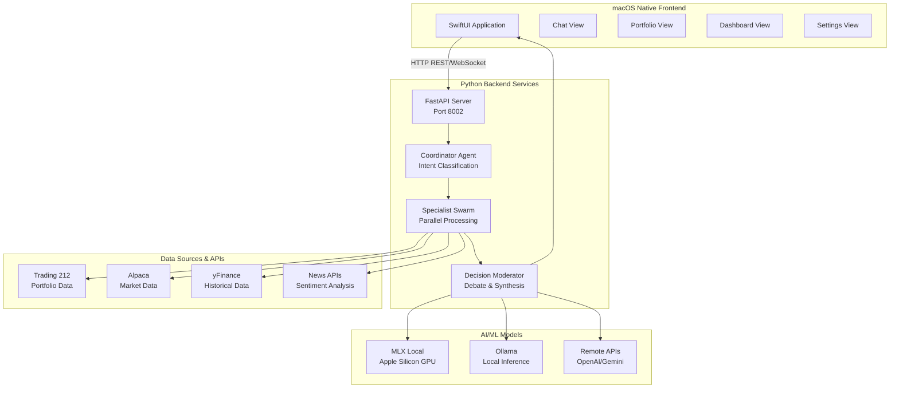
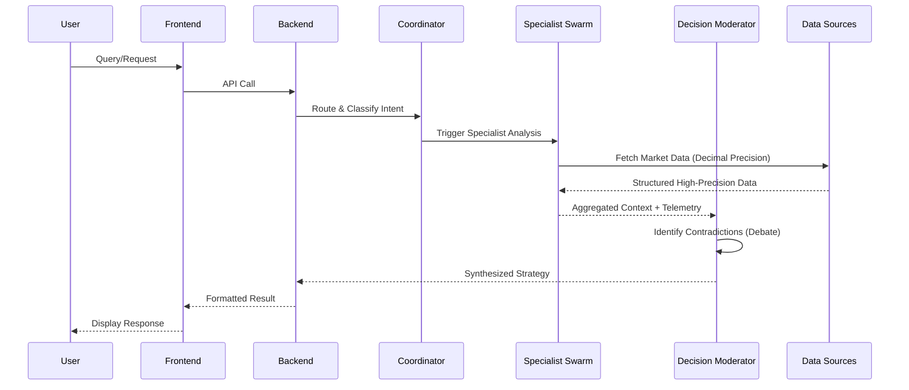

# Growin - Comprehensive AI-Powered Portfolio Intelligence Platform

**Growin** is a sophisticated, native macOS application that combines advanced AI capabilities with real-time financial data to provide intelligent portfolio analysis, automated trading insights, and conversational financial advice. Built specifically for Apple Silicon, it leverages local LLMs and optimized algorithms for privacy-focused, high-performance financial intelligence.

[](https://developer.apple.com/macos/)
[](https://developer.apple.com/xcode/swiftui/)
[](https://www.python.org/)
[](https://fastapi.tiangolo.com/)

## 🏗️ System Architecture

Growin implements a **hybrid algorithmic-LLM architecture** that combines structured quantitative analysis with advanced AI reasoning. High-performance paths are accelerated via a **Rust Native Core** and **Vectorized Python Agents**.

### Key SOTA Features (2026)
- **💎 Financial Precision Layer**: Eliminates binary float errors using string-initialized `Decimal` arithmetic. 100% accurate P&L and balance tracking.
- **🤝 Agentic Debate Model**: A collaborative system where specialized agents (Quant, Sentiment, Risk) debate and resolve contradictions before reaching a final decision.
- **📡 Structured Telemetry & Tracing**: Full end-to-end observability of the AI reasoning chain, including latency, model versioning, and correlation IDs.
- **🚀 Bolt-Optimized Quant Engine**: Rust-accelerated technical analysis (EMA, RSI) with MLX-optimized inference for Apple Silicon.
- **🛡️ Sentinel Security Enclave**: AST-validated Python sandboxing with log-masking for agent safety, evolving toward Docker-based isolation.
- **🎨 Palette UI System**: Accessible, 120Hz smooth interface with glassmorphism and native macOS traits.

### High-Level System Overview


### Data Flow Architecture


## 🚀 Comprehensive Setup Guide

### Prerequisites & System Requirements

#### Hardware Requirements
- **macOS Version**: 13.0+ (Ventura) or 14.0+ (Sonoma) - Apple Silicon required
- **Processor**: Apple Silicon (M1/M2/M3/M4) - **Optimized for M4 Pro with 48GB Unified Memory**
- **RAM**: Minimum 16GB, Recommended 32GB+ for MLX models
- **Storage**: 15GB+ free space for models and data (Granite-Tiny ~7.4GB)
- **Network**: Stable internet for API calls and model downloads

#### Software Dependencies
```bash
# Required System Packages
brew install python@3.11 git

# Optional: Local LLM Providers
brew install ollama          # For Ollama models
# LM Studio: Download from lmstudio.ai

# Development Tools
brew install redis           # For caching (optional)
```

#### API Keys Required
| Service | Purpose | Where to Get | Cost |
|---------|---------|--------------|------|
| **Trading 212** | Portfolio data | [trading212.com/api](https://trading212.com/api) | Free/Paid |
| **OpenAI** | GPT models | [platform.openai.com](https://platform.openai.com/api-keys) | Pay-per-use |
| **Google Gemini** | Gemini models | [aistudio.google.com](https://aistudio.google.com/app/apikey) | Free tier available |
| **NewsAPI** | Market news | [newsapi.org](https://newsapi.org) | Free tier available |
| **TAVILY** | Web search | [tavily.com](https://tavily.com) | Free tier available |

### Step-by-Step Installation

#### 1. Clone and Prepare Repository
```bash
# Clone the repository
git clone https://github.com/sanketmane/growin-app.git
cd growin-app

# Ensure correct Python version
python3.11 --version  # Should be 3.11.x

# Create virtual environment (uv recommended)
pip install uv
uv venv
source .venv/bin/activate
```

#### 2. Backend Setup & Dependencies
```bash
# Install Python dependencies
uv pip install -r backend/requirements.txt

# Optional: Install TA-Lib (technical analysis)
# Note: TA-Lib has C dependencies, may require additional setup
brew install ta-lib
uv pip install TA-Lib
```

#### 3. Configure Environment Variables
```bash
# Create environment file
cp backend/.env.example backend/.env

# Edit with your API keys
nano backend/.env
```

**Required Environment Variables:**
```bash
# Trading 212 API (Required for portfolio)
T212_INVEST_KEY=your_invest_api_key
T212_ISA_KEY=your_isa_api_key

# LLM Providers (Choose at least one)
OPENAI_API_KEY=your_openai_key
GEMINI_API_KEY=your_gemini_key

# Application Settings
DEBUG=true
```

#### 4. Start Backend Services
```bash
# Use the simplified startup script
./run

# This handles environment setup, dependencies, and server launch automatically.
```

#### 5. Frontend Setup & Build
```bash
# Open Xcode project
open Growin/Growin.xcodeproj

# In Xcode:
# 1. Select "Growin" target
# 2. Choose your Apple Silicon device/simulator
# 3. Press Cmd+R to build and run
```

### 🧪 Testing & Precision
Run the comprehensive test suite to verify the **Financial Precision Layer**:
```bash
PYTHONPATH=. uv run pytest backend/tests/test_financial_precision.py backend/tests/test_agents.py
```

## 📜 Documentation
*   `ARCHITECTURE.md`: Deep dive into system design and diagrams.
*   `MAS_Strategy.md`: 2026 SOTA Multi-Agent Strategy & Roadmap.
*   `AGENTS.md`: Detailed agent roles and debate protocols.

---

*Growin - Transforming financial intelligence through the power of AI and Apple Silicon.* 🚀
