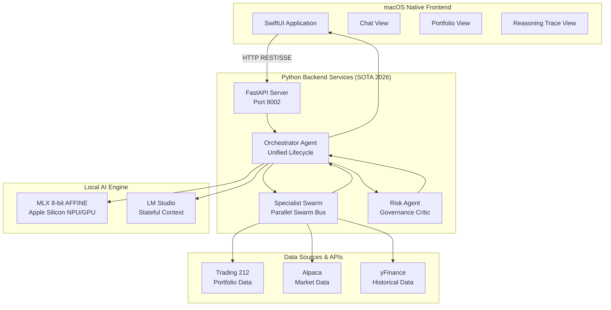

# Growin - Comprehensive AI-Powered Portfolio Intelligence Platform

**Growin** is a sophisticated, native macOS application that combines advanced AI capabilities with real-time financial data to provide intelligent portfolio analysis, automated trading insights, and conversational financial advice. Built specifically for Apple Silicon, it leverages local LLMs and optimized algorithms for privacy-focused, high-performance financial intelligence.

[](https://developer.apple.com/macos/)
[](https://developer.apple.com/xcode/swiftui/)
[](https://www.python.org/)
[](https://fastapi.tiangolo.com/)

## 🏗️ System Architecture (SOTA 2026)

Growin implements a **Flattened Multi-Agent Architecture** optimized for low-latency reasoning and strict financial governance.

### Key SOTA Features (Phases 16-20)
- **🚀 Unified Orchestration**: Replaces multi-hop hierarchies with a single-lifecycle `OrchestratorAgent` for sub-500ms routing and synthesis.
- **🧵 Trajectory Stitching**: Dynamically merges disparate specialist signals (Quant, News, Forecast) into a coherent, chronological narrative before final synthesis.
- **🛡️ The Critic Pattern (ACE)**: Mandatory risk and compliance auditing via `RiskAgent`. Employs a multi-turn Adversarial Confidence Estimation (ACE) loop before any recommendation reaches the user.
- **🗂️ Multi-Account Synergy**: Consolidated global portfolio tracking across Invest, ISA, and CFD accounts for true holistic weighting.
- **💸 Tax-Loss Harvesting (TLH)**: Automated scanning of taxable accounts to identify loss-harvesting opportunities, protected by strict Wash-Sale safety gates.
- **⚡ 8-bit AFFINE Optimization**: Hardware-level quantization for MLX models, specifically tuned for the M4 Pro NPU and Unified Memory.
- **📡 AG-UI Streaming Protocol**: Real-time transparency via `AgentMessenger`, streaming granular lifecycle events directly to SwiftUI (`ReasoningTraceView`).
- **💎 Financial Precision Layer**: String-initialized `Decimal` arithmetic for 100% accurate P&L and balance tracking.
- **🔒 HITL Trade Gates**: Backend enforcement of Human-in-the-Loop signatures (HMAC) for any automated trade execution via MCP.

### High-Level System Overview


## 🚀 Installation & Setup

### Hardware Requirements
- **macOS Version**: 14.0+ (Sonoma) - Apple Silicon required.
- **Processor**: Optimized for **M4 Pro/Max** with Unified Memory (24GB+ recommended).
- **Inference**: Native MLX support with 8-bit AFFINE quantization enabled.

### Quick Start
```bash
# 1. Clone the repository
git clone https://github.com/sanketmane/growin-app.git
cd growin-app

# 2. Setup Environment
cp backend/.env.example backend/.env
# Edit backend/.env with your T212, Alpaca, and LLM API keys.

# 3. Launch Backend (uv recommended)
./run

# 4. Launch Frontend
open Growin/Growin.xcodeproj
# Press Cmd+R in Xcode to build and run.
```

### 🧪 Verification Suite
Verify the Phase 20 Architecture:
```bash
# Run the unified SOTA backend test suite
uv run --project backend pytest tests/backend/
```

## 📜 Documentation
*   `docs/architecture_evolution_SOTA.md`: Deep dive into the flattened MAS and 2026 SOTA research.
*   `docs/ARCHITECTURE.md`: Technical system diagrams and precision specs.
*   `docs/MAS_Strategy.md`: Multi-Agent Strategy and Governance roadmap.

---
*Growin - Transforming financial intelligence through the power of AI and Apple Silicon.* 🚀
