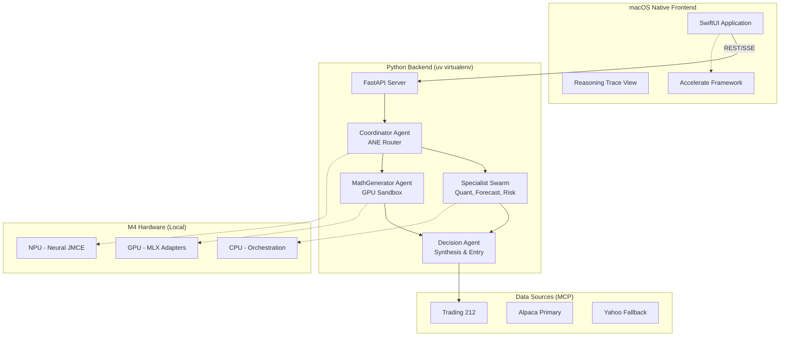

# Growin - Comprehensive AI-Powered Portfolio Intelligence Platform

**Growin** is a sophisticated, native macOS application that combines advanced AI capabilities with real-time financial data to provide intelligent portfolio analysis, automated trading insights, and conversational financial advice. Built specifically for **Apple Silicon (M4 optimized)**, it leverages local LLMs, Neural JMCE, and MLX Weight Adapters for privacy-focused, high-performance financial autonomy.

[](https://developer.apple.com/macos/)
[](https://developer.apple.com/xcode/swiftui/)
[](https://www.python.org/)
[](https://fastapi.tiangolo.com/)

## 🏗️ System Architecture (SOTA 2026 Phase 32)

Growin implements a **Hardware-Aware Multi-Agent Architecture** optimized for Apple Silicon partitioning (CPU/GPU/NPU).

### Key SOTA Features (Phases 31-32)
- **⚡ M4 Hardware Partitioning**: Intelligently routes high-frequency orchestration to the CPU (AMX), LLM reasoning to the GPU (MLX), and Neural JMCE inference to the NPU (ANE).
- **🧠 Neural JMCE**: Joint Mean-Covariance Estimator running natively on the Apple Neural Engine for real-time volatility regime detection and correlation shift analysis.
- **🚀 Autonomous Autopilot**: Move beyond simple proposals with **High Conviction Bypasses**. If the Swarm detects a 10/10 setup, the system autonomously executes trades on Trading 212 via a secure local sandbox.
- **🛠️ MLX Weight Adapters**: On-the-fly model calibration. The system performs daily GPU re-training to adjust model weights based on recent market error feedback.
- **💎 Ticker Fidelity**: Robust `TickerResolver` that maps complex brokerage symbols to global standards, including automated GBX (pence) to GBP (£) normalization.
- **📡 Reasoning Trace**: Real-time streaming of agent "thoughts" via SSE, visualized in SwiftUI with Metal-accelerated effects.

### High-Level System Overview

```mermaid
graph TB
    subgraph "macOS Native Frontend"
        UI[SwiftUI Application]
        RV[Reasoning Trace View]
        ACC[Accelerate Framework]
    end

    subgraph "Python Backend (uv virtualenv)"
        API[FastAPI Server]
        COORD[Coordinator Agent<br/>ANE Router]
        SWARM[Specialist Swarm<br/>Quant, Forecast, Risk]
        MATH[MathGenerator Agent<br/>GPU Sandbox]
        DECISION[Decision Agent<br/>Synthesis & Entry]
    end

    subgraph "Data Sources (MCP)"
        T212[Trading 212]
        ALP[Alpaca Primary]
        YF[Yahoo Fallback]
    end

    subgraph "M4 Hardware (Local)"
        AMX[CPU - Orchestration]
        METAL[GPU - MLX Adapters]
        ANE[NPU - Neural JMCE]
    end

    UI -->|REST/SSE| API
    API --> COORD
    COORD --> SWARM
    COORD --> MATH
    SWARM --> DECISION
    MATH --> DECISION
    DECISION --> T212

    COORD -.-> ANE
    MATH -.-> METAL
    SWARM -.-> AMX
    UI -.-> ACC
```

## 🚀 Installation & Setup

### Hardware Requirements
- **macOS Version**: 14.0+ (Sonoma) - Apple Silicon required.
- **Processor**: Optimized for **M4 Pro/Max/Ultra**.
- **Inference**: Native MLX support required for local model calibration.

### Quick Start
```bash
# 1. Clone the repository
git clone https://github.com/sanketmane/growin-app.git
cd growin-app

# 2. Setup Environment
cp backend/.env.example backend/.env
# Edit backend/.env with your T212, Alpaca, and LM Studio credentials.

# 3. Launch Backend
./start.sh

# 4. Launch Frontend
open Growin/Growin.xcodeproj
# Press Cmd+R in Xcode to build and run.
```

### 🧪 Verification Suite
Verify the latest architecture and ticker normalization:
```bash
# Run the intraday backtest script
PYTHONPATH=.:backend uv run scripts/backtest_portfolio_today.py
```

## 📜 Documentation
*   `docs/ARCHITECTURE.md`: Technical system diagrams and precision specs.
*   `docs/architecture_evolution_SOTA.md`: Deep dive into the transition from Copilot to Autonomous Autopilot.
*   `docs/mac_native_architecture.md`: Blueprint for Apple Silicon M4 hardware partitioning.

---
*Growin - Transforming financial intelligence through the power of AI and Apple Silicon.* 🚀
