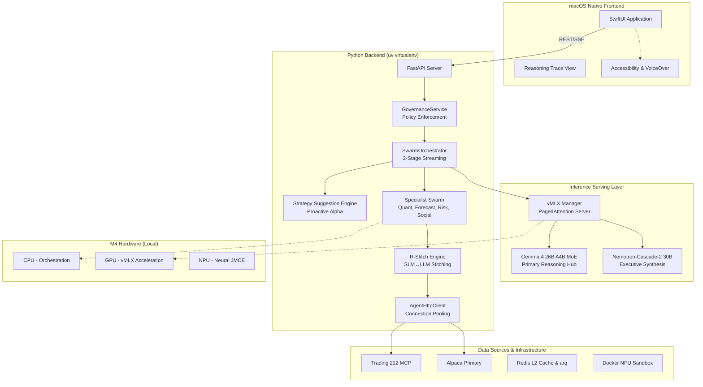

# Growin - Comprehensive AI-Powered Portfolio Intelligence Platform

**Growin** is a sophisticated, native macOS application that combines advanced AI capabilities with real-time financial data to provide intelligent portfolio analysis, automated trading insights, and conversational financial advice. Built specifically for **Apple Silicon (M4 optimized)**, it leverages a dual-model local LLM architecture, the vMLX PagedAttention inference serving layer, and Neural JMCE for privacy-focused, high-performance financial autonomy.

[](https://developer.apple.com/macos/)
[](https://developer.apple.com/xcode/swiftui/)
[](https://www.python.org/)
[](https://www.rust-lang.org/)
[](https://github.com/ml-explore/mlx)
[](https://www.docker.com/)
[](https://fastapi.tiangolo.com/)

---

## 🏗️ System Architecture

Growin implements a **Hardware-Aware Multi-Agent Architecture** optimized for Apple Silicon partitioning (CPU/GPU/NPU), paired with a **Sovereign Ledger (Brutal Editorial) UI** generated via SwiftUI.


```mermaid
graph TB
    subgraph "macOS Native Frontend"
        UI[SwiftUI Application]
        RV[Reasoning Trace View]
        ACC[Accessibility & VoiceOver]
    end

    subgraph "Inference Serving Layer"
        VMLX[vMLX Manager<br/>PagedAttention Server]
        GEMMA4[Gemma 4 26B A4B MoE<br/>Primary Reasoning Hub]
        NEMOTRON[Nemotron-Cascade-2 30B<br/>Executive Synthesis]
    end

    subgraph "Python Backend (uv virtualenv)"
        API[FastAPI Server]
        ORCH[SwarmOrchestrator<br/>2-Stage Streaming]
        GOV[GovernanceService<br/>Policy Enforcement]
        STRAT[Strategy Suggestion Engine<br/>Proactive Alpha]
        SWARM[Specialist Swarm<br/>Quant, Forecast, Risk, Social]
        RSTITCH[R-Stitch Engine<br/>SLM↔LLM Stitching]
        POOL[AgentHttpClient<br/>Connection Pooling]
    end

    subgraph "Data Sources & Infrastructure"
        T212[Trading 212 MCP]
        ALP[Alpaca Primary]
        REDIS[Redis L2 Cache & arq]
        DOCKER[Docker NPU Sandbox]
    end

    subgraph "M4 Hardware (Local)"
        AMX[CPU - Orchestration]
        METAL[GPU - vMLX Acceleration]
        ANE[NPU - Neural JMCE]
    end

    UI -->|REST/SSE| API
    API --> GOV
    GOV --> ORCH
    ORCH --> STRAT
    ORCH --> SWARM
    SWARM --> RSTITCH
    RSTITCH --> POOL
    POOL --> T212
    POOL --> ALP
    
    VMLX --> GEMMA4
    VMLX --> NEMOTRON
    ORCH --> VMLX
    
    VMLX -.-> METAL
    SWARM -.-> AMX
    UI -.-> ACC
```

### Key Architectural Upgrades & SOTA Features
*   **🧠 Dual-Model Intelligence**: Combines **Gemma 4 26B A4B MoE** (our primary reasoning hub) with **Nemotron-Cascade-2 30B** (our executive synthesis model) for deep financial analysis, trading strategies, and code synthesis.
*   **⚡ vMLX Serving Layer**: High-performance local serving utilizing PagedAttention. Replaces direct unmanaged MLX calls, allowing low-latency parallel agent requests with dynamic KV-cache management optimized for Apple Silicon GPUs.
*   **🌊 SwarmOrchestrator & Strategy Engine**: A two-stage streaming agent delegation pipeline. The Coordinator incorporates a proactive **Strategy Suggestion Engine** that continuously analyzes the ledger and yields real-time, high-conviction trade and alpha recommendations.
*   **🛡️ Governance & Authorization**: The **GovernanceService** enforces strict runtime agent authorization, input validation, and system boundaries, serving as a runtime policy engine for safe, autonomous trading.
*   **🔗 Global Connection Pooling**: Centralized **AgentHttpClient** with endpoint-specific circuit breakers and automated token-bucket rate limiting. Replaces per-agent HTTP client instantiation and eliminates socket exhaustion under heavy swarm loads.
*   **🖼️ Async VLM Pipelines & Vectorization**: Non-blocking image processing via `prepare_vlm_image_async()`, paired with vectorized portfolio metrics in pandas and DuckDB batch query optimization (`get_recent_ohlcv`) to avoid N+1 query patterns.
*   **♿ Comprehensive VoiceOver Accessibility**: Fully integrated accessibility modifiers (`.accessibilityLabel`, `.accessibilityHint`, `.accessibilityAddTraits`) across all SwiftUI view components.
*   **🎨 Sovereign UI Aesthetics**: Radical, high-density Trading 212-inspired ledger aesthetics with 0px corner radiuses, tonal layering, and authoritative typography.

---

## 🚀 Installation & Setup

### Hardware Requirements
- **macOS Version**: 15.0+ (Sequoia) - Apple Silicon required.
- **Processor**: Optimized for **M4 Pro/Max/Ultra** architectures.
- **Memory**: 32GB+ unified memory recommended (48GB+ preferred for dual-model concurrent serving).
- **Inference**: Local vMLX service with Apple Silicon GPU acceleration.

### Quick Start
1. **Clone the repository**
   ```bash
   git clone https://github.com/sanketmane/Growin-app.git
   cd Growin-app
   ```

2. **Setup Environment**
   ```bash
   cp backend/.env.example backend/.env
   # Edit backend/.env with your API keys, vMLX endpoints, and credentials.
   ```

3. **Launch the System Services**
   The project is managed using `uv` for Python environments. Use the helper scripts to start/stop the backend stack:
   ```bash
   ./start.sh
   ```

4. **Launch Frontend**
   ```bash
   open Growin/Growin.xcodeproj
   # Press Cmd+R in Xcode to build and run.
   ```

---

## 🧪 Verification Suite

Verify the system architecture, connection pooling, and ticker normalization:
```bash
# Run the intraday backtest and validation scripts
PYTHONPATH=.:backend uv run scripts/backtest_portfolio_today.py

# Run backend unit and integration test suite
uv run pytest

# Verify NPU degradation / CPU fallback behavior manually
PYTHONPATH=backend uv run python3 tests/verify_mlx_degradation.py

# Verify QuantAgent indicators and ORB detection manually
PYTHONPATH=backend uv run python3 tests/verify_quant.py
```

---

## 📜 Documentation Directory

### Architecture & Design
*   [docs/ARCHITECTURE.md](docs/ARCHITECTURE.md) - System context, component designs, and agent relationships.
*   [docs/architecture_evolution_SOTA.md](docs/architecture_evolution_SOTA.md) - Chronological roadmap of architectural milestones.
*   [docs/ARCHITECTURAL_LEARNINGS.md](docs/ARCHITECTURAL_LEARNINGS.md) - Extracted lessons on connection pooling, vectorization, and async runtime issues.
*   [docs/mac_native_architecture.md](docs/mac_native_architecture.md) - Apple Silicon memory budgets and SwiftUI component inventory.
*   [docs/MAS_Strategy.md](docs/MAS_Strategy.md) - Multi-Agent System (MAS) strategy, coordinator workflows, and agent execution policies.

### Operations & Guidelines
*   [docs/runbook.md](docs/runbook.md) - Setup, vMLX management, connection diagnostics, and verification checklists.
*   [docs/model-selection-playbook.md](docs/model-selection-playbook.md) - Dual-model routing decisions and task-based model recommendations.
*   [docs/LIFECYCLE_MANDATES.md](docs/LIFECYCLE_MANDATES.md) - Tear-down guidelines for background services and memory limits.

---
*Growin - Transforming financial intelligence through the power of AI and Apple Silicon.* 🚀
