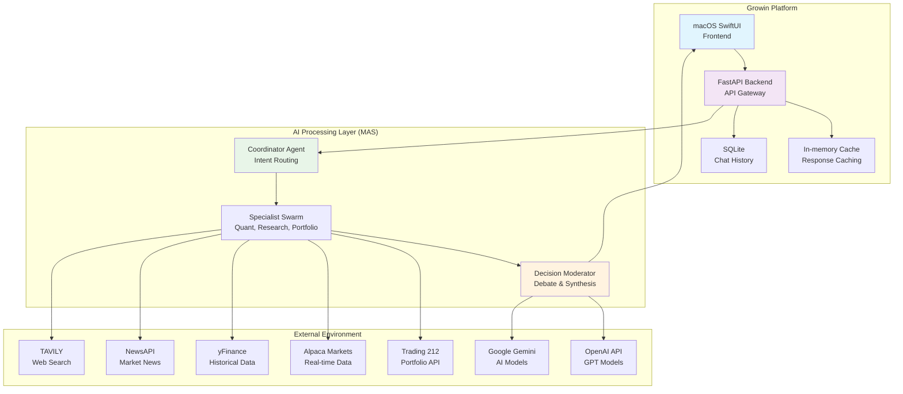
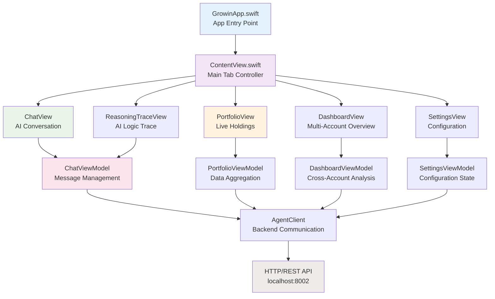
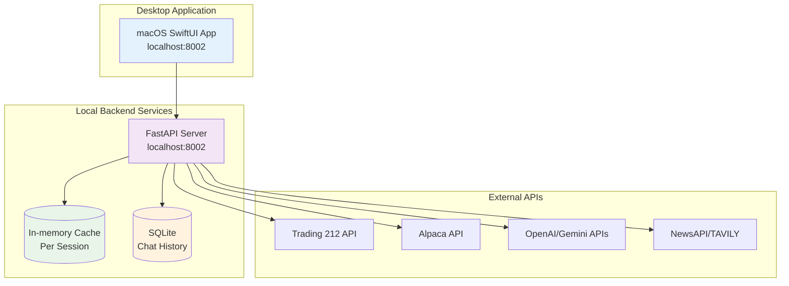
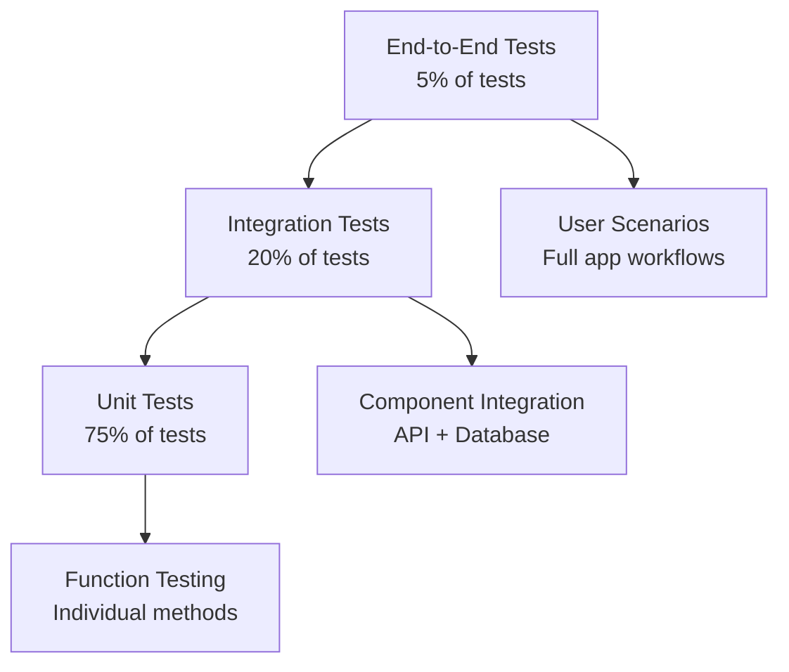

# Growin Architecture: Comprehensive AI-Powered Portfolio Intelligence Platform

## Executive Summary

**Growin** is a sophisticated financial intelligence platform that combines advanced artificial intelligence with real-time market data to provide intelligent portfolio analysis, automated trading insights, and conversational financial advice. In 2026, it adheres to SOTA best practices for **Agentic Autonomy**, **Financial Precision**, and **Local Inference**.

### System Vision
To democratize sophisticated financial analysis by providing retail investors with institutional-grade portfolio intelligence through an intuitive, AI-powered macOS application optimized for Apple Silicon hardware.

---

## 1. System Context & High-Level Architecture

### System Context Diagram

---

## 2. Financial Precision Layer (2026 SOTA)
To eliminate "one-cent drift" and binary floating-point errors common in financial apps, Growin implements a dedicated Precision Layer.

- **Engine**: All monetary calculations use Python `decimal.Decimal`.
- **Initialization**: Decimals are initialized exclusively from string representations to avoid implicit float conversion.
- **Rounding**: Standardized on `ROUND_HALF_UP` (Commercial Rounding).
- **Scale**: Intermediate calculations use 4 decimal places; display outputs are quantized to 2 places (`0.01`).
- **Validation**: Every price fetch is verified across multiple sources (Alpaca, yFinance, T212) with a `0.5%` variance threshold.

---

## 3. Stability & Resilience (Phase 12 Hardening)
To ensure production-grade reliability on macOS, the system underwent a rigorous hardening phase focused on crash resolution and architectural purity.

- **Crash Resolution (SectorMark)**: Resolved persistent memory and data-filtering crashes in the chart rendering pipeline by implementing strict defensive checks in `calculateAllocationData`, ensuring only positive, non-zero values reach the `SectorMark` view.
- **Architectural Purity**: Verified a "pure-play" macOS native architecture. All remaining iOS/UIKit traces were removed, ensuring `NSViewRepresentable` is used correctly for Metal-backed views.
- **Memory Management**: Implemented explicit `deinit` cleanup and cancellation tokens for long-running data synchronization tasks to prevent memory leaks during rapid context switching in the MAS.
- **Concurrency Safety**: Conducted a full audit of `@MainActor` isolation for UI-bound view models, preventing race conditions during high-frequency market data updates.

---

## 4. Agentic Reasoning & Collaborative Debate
Instead of a single "Chain of Thought," Growin uses a **Multi-Agent Debate Model**.

### The Debate Phase
1.  **Specialist Analysis**: The Swarm executes in parallel (e.g., `QuantAgent` finds a bullish pattern, while `ResearchAgent` finds negative earnings news).
2.  **Contradiction Identification**: The **Decision Moderator** identifies conflicting signals.
3.  **Synthesis**: The LLM reconciles these signals (e.g., "The technical breakout is strong, but the macro sentiment suggests a trap; recommend caution").

### Structured Telemetry
Every reasoning chain is traceable via **TelemetryData**:
- **Correlation ID**: Links every specialist output to the final user response.
- **Latency Tracking**: High-precision timing for every agent hop.
- **Reasoning Trace**: The `MarketContext` accumulates full agent rationale for auditability.

---

## 4. Frontend Architecture (macOS SwiftUI)

### UI/UX Paradigm: High-Fidelity & Emotionally Intelligent
Growin's 2026 frontend embraces a "Calm UI" philosophy with a "Liquid Glass" design language, delivering a premium, high-performance, and emotionally regulated user experience.

-   **Calm UI**: Interfaces adapt to user cognitive states, employing soft gradients and neutral palettes to reduce stress, especially during market volatility. Critical warnings are reserved for genuine risks.
-   **Liquid Glass Design**: Translucent surfaces, background blurs, and diffused shadows create a sophisticated, immersive aesthetic, bridging 2D interfaces with future 3D/AR environments.
-   **Bento Grid Architecture**: Modular information architecture for dashboards, allowing diverse content (charts, metrics, AI text) to coexist with clear visual hierarchy, ensuring functional data density.
-   **Multi-Agent Transparency (Glass Box AI)**: AI insights are presented with "Confidence Visualization Patterns" (CVP) and "Progressive Disclosure," allowing users to understand the AI's reasoning without cognitive overload.

### Core UI Components & Design System
All UI elements are standardized within a `Palette` component library, built for consistency and reusability.
-   **GlassCard**: Enhanced with Liquid Glass effects, serving as a primary container for information.
-   **PremiumButton**: Designed for clear, tactile feedback.
-   **AgentStatusBadge**: Visualizes agent states and confidence.
-   **FinancialMetricView**: Displays key financial data with high precision.

### High-Performance Rendering (120Hz Optimized)
Optimized for Apple's ProMotion displays, ensuring a superfluid 120Hz experience.
-   **Metal-Backed SwiftUI Charts**: Core financial charts (e.g., `PerformanceLineChart`) are powered by native Metal compute shaders via `NSViewRepresentable` for GPU-accelerated, dual-pipeline rendering (visuals vs. indicator calculations), handling millions of data points without frame drops.
-   **Main-Thread Isolation**: All data fetching, AI reasoning, and real-time stream processing (SSE/WebSockets) are strictly offloaded to background `Task`s or `Actors`, ensuring the main thread remains unblocked for smooth UI interactions.
-   **Optimistic State Management**: SwiftUI's `@State` and `@Binding` are leveraged for instant UI feedback on user actions (e.g., trade execution), paired with custom `CoreHaptics` for tactile confirmation.

### Interactive AI: Reasoning Trace & Collaboration
The frontend provides unprecedented transparency and collaboration with the Multi-Agent System.
-   **Reasoning Trace UI**: A "Thinking..." expandable view showing step-by-step agent consultation via SSE, with "Confidence Visualization Patterns" and progressive disclosure.
-   **Challenge Logic Interface**: Users can interactively challenge specific logical steps within the reasoning trace, providing alternative data or questions to the local LLM, leading to user-AI collaboration.
-   **Revised Strategy Outcome Screen**: Presents the updated strategy after user feedback, highlighting changes and updated confidence, allowing for implementation or further refinement.

### Application Structure

---

## 5. Security Enclave & Agent Sandboxing
As AI agents move toward autonomy, the **Sentinel Security Layer** provides robust guardrails.

### Safe Code Execution
-   **Current**: `SafePythonExecutor` uses AST analysis and restricted builtins to execute model-generated "fixes".
-   **Roadmap**: Migration to **Docker-based Isolation** via Docker MCP for 2026 SOTA agent safety. This is now **CONFIRMED** and actively being integrated for the interactive Python sandbox.
  
---

## 6. Deployment & Operations

### Deployment Architecture

---

## 7. Testing Architecture

### Test Pyramid Implementation

*Note: Special emphasis is placed on **Financial Precision Tests** to ensure zero regression in Decimal math.*
