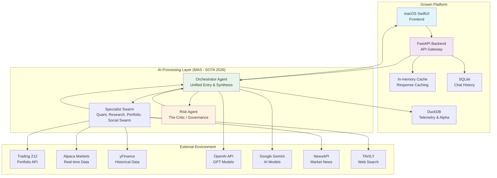
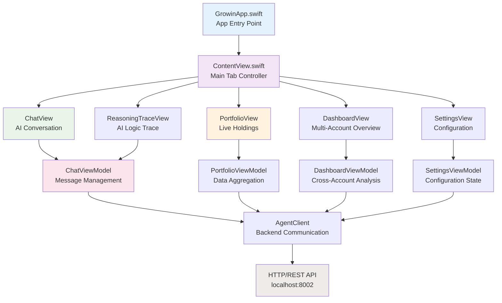

# Growin Architecture: Comprehensive AI-Powered Portfolio Intelligence Platform

## Executive Summary

**Growin** is a sophisticated financial intelligence platform that combines advanced artificial intelligence with real-time market data to provide intelligent portfolio analysis, automated trading insights, and conversational financial advice. In 2026, it adheres to SOTA best practices for **Agentic Autonomy**, **Financial Precision**, and **Local Inference**.

### System Vision
To democratize sophisticated financial analysis by providing retail investors with institutional-grade portfolio intelligence through an intuitive, AI-powered macOS application optimized for Apple Silicon hardware.

---

## 1. System Context & High-Level Architecture

### System Context Diagram

---

## 2. Flattened MAS Architecture (Phases 16-20)
As of Phase 20, Growin has migrated to a flattened hierarchy to reduce latency, improve reasoning coherence, and integrate advanced tax-aware logic.

### The Unified Orchestrator
The `OrchestratorAgent` replaces the previous multi-hop "Coordinator + Decision" model.
- **Single Hop**: Natural language is directly classified and dispatched by the Orchestrator.
- **Parallel Swarm**: Specialists (Quant, Research, Portfolio, Whale, Social Swarm) execute concurrently via `asyncio.gather`.
- **Trajectory Stitching**: The `TrajectoryStitcher` merges disparate signals into a coherent chronological narrative.
- **Dynamic Weighting**: The synthesis prompt is biased using historical alpha metrics fetched from `AnalyticsDB`.
- **Integrated Reasoning**: The Orchestrator performs final synthesis using 2026 SOTA local models (e.g., LFM 2.5, Granite 4.0).

### The Critic Pattern & ACE (Risk Governance)
Mandatory auditing is performed by the `RiskAgent` before any suggestion reaches the user.
- **Audit Stage**: Every proposed strategy is audited for exposure, compliance, and volatility risks.
- **Adversarial Debate**: 'The Contrarian' persona challenges the Orchestrator's thesis, forcing up to 2 rounds of rebuttal.
- **ACE Scoring**: `ACEEvaluator` calculates an Adversarial Confidence Estimation score based on debate robustness.
- **Safety Gates**: Risk Agent appends warnings or blocks suggestions that exceed safety thresholds.

### Multi-Account Synergy & TLH
- **Consolidation**: `PortfolioAgent` aggregates positions across Invest, ISA, and CFD accounts for global weighting.
- **Tax-Loss Harvesting**: `TLHScanner` identifies losing positions in taxable accounts for tax optimization.
- **Wash-Sale Gate**: `RiskAgent` blocks the repurchasing of harvested assets within a 30-day window.

---

## 3. Financial Precision & Hardware Optimization
To maximize performance on Apple Silicon M4 Pro, the system leverages hardware-level optimizations.

- **8-bit AFFINE Quantization**: Implemented in `mlx_engine.py` to maximize NPU/GPU throughput while maintaining Decimal-level reasoning precision.
- **Precision Layer**: All monetary calculations use Python `decimal.Decimal` with string-only initialization and `ROUND_HALF_UP` standards.
- **Validation**: Every price fetch is verified across multiple sources with a `0.5%` variance threshold.

---

## 4. AG-UI Streaming & Telemetry
Transparency is achieved via real-time logic traces.

- **AgentMessenger**: A decoupled message bus that broadcasts granular lifecycle events (e.g., `intent_classified`, `swarm_started`, `risk_review_started`).
- **Reasoning Trace UI**: SwiftUI `ReasoningTraceView` uses `PhaseAnimator` to visualize live agent state changes from the SSE stream.
- **HITL Verification**: High-stakes actions require a signed HMAC `approval_token` generated by the UI after user confirmation.

---

## 5. Local LLM Strategy & Model Management (Phase 14/15)
To maximize privacy and performance, Growin prioritizes local inference while maintaining a flexible, multi-provider backend.

### Dynamic Model Management (Phase 14)
Growin implements a dynamic management layer for local LLMs, specifically optimized for LM Studio 0.4.x.
- **On-Demand Loading**: Models are loaded/unloaded dynamically via the Preferences UI, preventing VRAM over-allocation.
- **VRAM Guard**: Implements a "60% RAM Rule" for Apple Silicon (M4 Pro/Max) to ensure LLM memory bandwidth doesn't starve the OS or the SwiftUI Metal pipeline.

### Stateful Chat Architecture (Phase 15)
The conversational engine transitioned from stateless history injection to a **Server-Side Stateful** model.
- **Context Preservation**: Uses LM Studio's Native V1 `/api/v1/chat` with `response_id` linking.
- **Thinking Extraction (CoT)**: Automatically extracts `<think>` tags from reasoning models and stores them in `MarketContext.reasoning`.

---

## 6. Security Enclave & Agent Sandboxing
As AI agents move toward autonomy, the **Sentinel Security Layer** provides robust guardrails.

### Safe Code Execution
- **Docker-based Isolation**: Migration to Docker MCP for 2026 SOTA agent safety. Model-generated code is executed in isolated containers.
- **Trade Approval Gate**: Backend HITL enforcement prevents any autonomous trade execution without a valid UI-generated signature.

---

## 7. Application Structure (SwiftUI Frontend)

