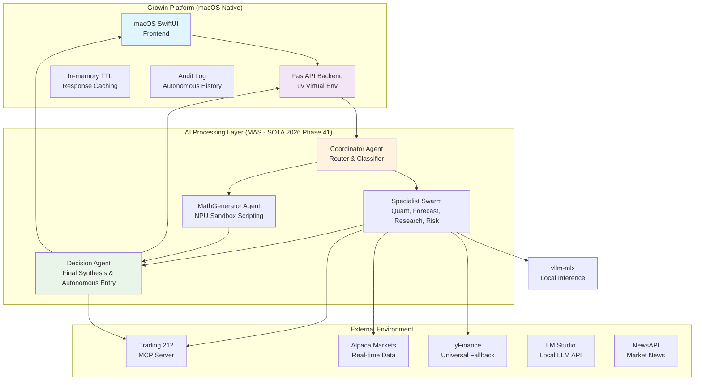

# Growin Architecture: Comprehensive AI-Powered Portfolio Intelligence Platform

## Executive Summary

**Growin** is a sophisticated financial intelligence platform that combines advanced artificial intelligence with real-time market data to provide intelligent portfolio analysis, automated trading insights, and conversational financial advice. In 2026, it adheres to SOTA best practices for **Agentic Autonomy**, **Financial Precision**, and **Hardware-Aware Local Inference**.

### System Vision
To democratize sophisticated financial analysis by providing retail investors with institutional-grade portfolio intelligence through an intuitive, AI-powered macOS application optimized for Apple Silicon (M4 generation) hardware.

---

## 1. System Context & High-Level Architecture

### System Context Diagram

```mermaid
graph TB
    subgraph "External Environment"
        T212[Trading 212<br/>MCP Server]
        ALP[Alpaca Markets<br/>Real-time Data]
        YF[yFinance<br/>Universal Fallback]
        LMSTUDIO[LM Studio<br/>Local LLM API]
        NEWS[NewsAPI<br/>Market News]
    end

    subgraph "Growin Platform (macOS Native)"
        UI[macOS SwiftUI<br/>Frontend]
        API[FastAPI Backend<br/>uv Virtual Env]
        CACHE[In-memory TTL<br/>Response Caching]
        AUDIT[Audit Log<br/>Autonomous History]
    end

    subgraph "AI Processing Layer (MAS - SOTA 2026 Phase 41)"
        COORD[Coordinator Agent<br/>Router & Classifier]
        SWARM[Specialist Swarm<br/>Quant, Forecast, Research, Risk]
        MATH[MathGenerator Agent<br/>NPU Sandbox Scripting]
        DECISION[Decision Agent<br/>Final Synthesis & Autonomous Entry]
    end

    UI --> API
    API --> COORD
    COORD --> SWARM
    COORD --> MATH
    SWARM --> DECISION
    MATH --> DECISION
    DECISION --> API
    DECISION --> UI

    SWARM --> T212
    SWARM --> ALP
    SWARM --> YF
    SWARM --> VLLM[vllm-mlx<br/>Local Inference]
    DECISION --> T212

    style UI fill:#e1f5fe
    style API fill:#f3e5f5
    style DECISION fill:#e8f5e8
    style COORD fill:#fff3e0
```

---

## 2. Agentic Swarm & Autonomous Execution (Phases 30-41)
As of Phase 41, Growin has transitioned from Human-in-the-Loop (HITL) only to a hybrid **Autonomous Agentic** model with radical **Sovereign UI** aesthetics.

### Multi-Agent Orchestration (Hybrid Tiered)
- **CoordinatorAgent**: Performs sub-100ms intent classification and delegates to specialists.
- **Specialist Swarm**:
    - **QuantAgent**: High-frequency indicators and statistical arbitrage.
    - **ForecasterAgent**: ML-driven price prediction.
    - **ResearchAgent**: RAG-enhanced market news analysis.
    - **RiskAgent**: Exposure auditing and volatility regime detection.
- **DecisionAgent (The Synthesis Brain)**:
    - Synthesizes all specialist signals into a final verdict.
    - **Autonomous Bypass**: If `CONVICTION LEVEL: 10` is detected, it autonomously executes trades on Trading 212, bypassing the UI confirmation gate.

### vllm-mlx Inference
- **Native Serving**: Uses `vllm-mlx` with PagedAttention for high-throughput local inference.
- **Privacy**: No financial data ever leaves the M4 hardware.

### Neural JMCE (Joint Mean-Covariance Estimator)
- **Regime-Aware Math**: Predicts returns and covariance shifts simultaneously.
- **Covariance Velocity**: Detects early-stage regime shifts (e.g., market panic) to boost ORB signal confidence.
- **Hardware Integration**: Runs on the Apple Neural Engine (ANE) via CoreML for <10ms inference.

---

## 3. Hardware-Aware Partitioning (M4 Optimized)
Growin maximizes the M4 Ultra/Pro architecture by intelligently routing workloads:

| Component | Hardware | Role |
|-----------|----------|------|
| **CPU (AMX)** | Apple Silicon CPU | Vectorized math, API routing, and system orchestration. |
| **GPU (Metal/MLX)** | Apple Silicon GPU | Local LLM inference, daily model re-training, and Weight Adapters. |
| **NPU (ANE)** | Apple Neural Engine | Real-time Neural JMCE inference and indicator forecasting. |

### Local Re-training (Weight Adapters)
- Implemented via `MLX` to perform daily calibration.
- Adjusts model weights on-the-fly based on prediction error vs. actual market feedback.

---

## 4. Data Fidelity & Normalization
- **TickerResolver**: Centralized engine in `utils/ticker_utils.py` that maps Trading 212 internal IDs (e.g., `VODl_EQ`) to market standards (`VOD.L`).
- **Currency Normalization**: Automatic GBX (pence) to GBP (£) conversion for LSE assets to ensure calculation accuracy.
- **Tiered Data Feed**: Alpaca (US Primary) -> Finnhub (UK Primary) -> Yahoo Finance (Fallback).

---

## 5. Security & Autonomy
- **Decision Sandbox**: The `MathGeneratorAgent` executes generated MLX scripts in a secure local sandbox (`safe_python.py`).
- **Audit Trail**: Every autonomous execution is logged with full reasoning context in the system audit logs.
- **Circuit Breakers**: MCP-level circuit breakers prevent cascade failures during high-volatility events.

---

## 6. Application Structure (SwiftUI Frontend)
The frontend is a lightweight command center that visualizes the backend's reasoning.
- **SSE Streaming**: Real-time agent thought traces streamed via Server-Sent Events.
- **Accelerate Integration**: Uses Apple's `Accelerate` framework for local portfolio rebalancing calculations.
- **Native Polish**: 120Hz fluid animations and deep macOS accessibility support.
