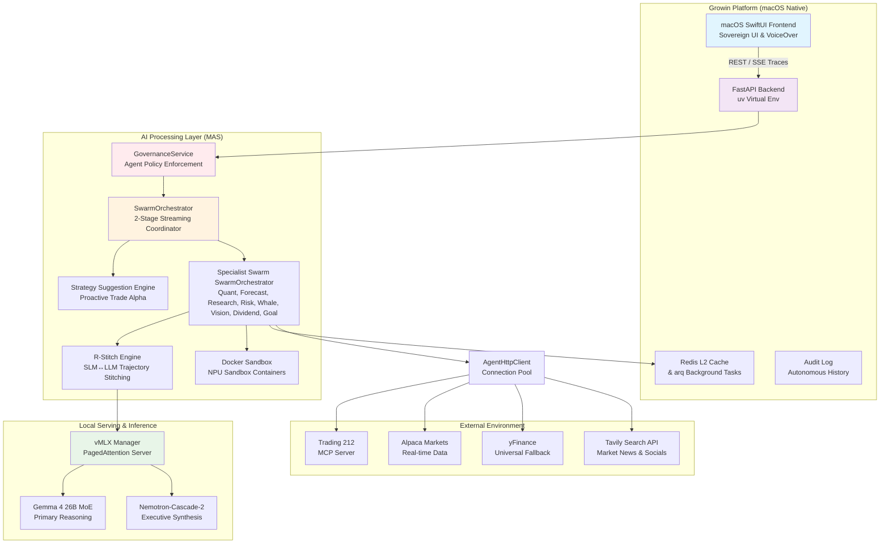

# Growin Architecture: Comprehensive AI-Powered Portfolio Intelligence Platform

## Executive Summary

**Growin** is a sophisticated financial intelligence platform that combines advanced artificial intelligence with real-time market data to provide intelligent portfolio analysis, automated trading insights, and conversational financial advice. It adheres to SOTA best practices for **Agentic Autonomy**, **Financial Precision**, and **Hardware-Aware Local Inference**.

### System Vision
To democratize sophisticated financial analysis by providing retail investors with institutional-grade portfolio intelligence through an intuitive, AI-powered macOS application optimized for Apple Silicon (M4 generation) hardware.

---

## 1. System Context & High-Level Architecture

### System Context Diagram

```mermaid
graph TB
    subgraph "External Environment"
        T212[Trading 212<br/>MCP Server]
        ALP[Alpaca Markets<br/>Real-time Data]
        YF[yFinance<br/>Universal Fallback]
        NEWS[Tavily Search API<br/>Market News & Socials]
    end

    subgraph "Growin Platform (macOS Native)"
        UI[macOS SwiftUI Frontend<br/>Sovereign UI & VoiceOver]
        API[FastAPI Backend<br/>uv Virtual Env]
        REDIS[Redis L2 Cache<br/>& arq Background Tasks]
        AUDIT[Audit Log<br/>Autonomous History]
    end

    subgraph "Local Serving & Inference"
        VMLX[vMLX Manager<br/>PagedAttention Server]
        GEMMA4[Gemma 4 26B MoE<br/>Primary Reasoning]
        NEMOTRON[Nemotron-Cascade-2<br/>Executive Synthesis]
    end

    subgraph "AI Processing Layer (MAS)"
        GOV[GovernanceService<br/>Agent Policy Enforcement]
        ORCH[SwarmOrchestrator<br/>2-Stage Streaming Coordinator]
        STRAT[Strategy Suggestion Engine<br/>Proactive Trade Alpha]
        SWARM[Specialist Swarm SwarmOrchestrator<br/>Quant, Forecast, Research, Risk, Whale, Vision, Dividend, Goal]
        RSTITCH[R-Stitch Engine<br/>SLM↔LLM Trajectory Stitching]
        DOCKER[Docker Sandbox<br/>NPU Sandbox Containers]
    end

    UI -->|REST / SSE Traces| API
    API --> GOV
    GOV --> ORCH
    ORCH --> STRAT
    ORCH --> SWARM
    SWARM --> RSTITCH
    RSTITCH --> VMLX
    SWARM --> DOCKER
    
    VMLX --> GEMMA4
    VMLX --> NEMOTRON

    SWARM --> REDIS
    SWARM --> POOL[AgentHttpClient<br/>Connection Pool]
    POOL --> T212
    POOL --> ALP
    POOL --> YF
    POOL --> NEWS
    
    style UI fill:#e1f5fe
    style API fill:#f3e5f5
    style ORCH fill:#fff3e0
    style VMLX fill:#e8f5e8
    style GOV fill:#ffebee
```

---

## 2. Agentic Swarm & Autonomous Execution

Growin implements a hybrid **Autonomous Agentic** model with radical **Sovereign UI** aesthetics and multi-model local inference.

### Multi-Agent Orchestration & Core Framework
*   **SwarmOrchestrator**: Manages a 2-stage streaming delegation pipeline, eliminating the latency of classic step-by-step reasoning.
*   **GovernanceService**: The central security gateway of the swarm. It enforces runtime policy checks, sanitizes inputs, handles agent execution limits, and verifies token authorizations.
*   **Strategy Suggestion Engine**: Embedded directly in the Coordinator flow, this engine proactively generates high-conviction trade and portfolio alpha recommendations based on real-time ledger metrics.
*   **R-Stitch Engine**: Optimizes model response time via Dynamic Trajectory Stitching (SLM↔LLM). Fast, non-critical sub-tasks use optimized Small Language Models, whereas heavy synthesis hops are dynamically stitched into Large Language Model inference runs.
*   **AgentHttpClient**: A centralized connection pooling client utilizing persistent `httpx.AsyncClient` connections, endpoint circuit breakers, and token-bucket rate limiting. Replaces per-agent individual HTTP clients to eliminate TCP socket exhaustion under multi-agent swarm loads.

### Specialist Agent Roster
1.  **QuantAgent**: High-frequency indicators, statistical arbitrage, and vectorized portfolio metrics.
2.  **ForecasterAgent**: ML-driven price prediction utilizing joint return volatility forecasting.
3.  **ResearchAgent**: RAG-enhanced market news analysis and semantic query synthesis.
4.  **RiskAgent**: Exposure auditing, leverage thresholds, and volatility regime detection.
5.  **WhaleAgent**: Analyzes large-block transaction footprints, institutional filings, and flow patterns.
6.  **VisionAgent**: Visual chart assessment, technical pattern analysis, and async image rendering.
7.  **DividendOptimizationAgent**: Long-term yield optimization, payout schedules, and tax-drag modeling.
8.  **GoalPlannerAgent**: Translates high-level user financial goals into actionable portfolio targets and trading milestones.

### Social Swarm (Reddit & Twitter micro-agents)
- Dedicated micro-agents in `backend/agents/social_swarm/` utilize Tavily Search APIs to perform sentiment profiling, social signal scoring, and retail momentum detection on Reddit and Twitter.

### Neural JMCE (Joint Mean-Covariance Estimator)
- **Regime-Aware Math**: Predicts returns and covariance shifts simultaneously.
- **Covariance Velocity**: Detects early-stage regime shifts (e.g., market panic) to boost ORB signal confidence.
- **Hardware Integration**: Runs on the Apple Neural Engine (ANE) via CoreML for <10ms inference.

---

## 3. Hardware-Aware Partitioning (M4 Optimized)

Growin maximizes the M4 generation Apple Silicon architectures by routing workloads dynamically to CPU, GPU, and NPU.

| Component | Hardware | Role | Memory & Execution Budget |
|-----------|----------|------|---------------------------|
| **CPU (AMX)** | Apple Silicon CPU | Vectorized math, API routing, and system orchestration. | Dynamic Core Allocations |
| **GPU (Metal/MLX)** | Apple Silicon GPU | Local LLM inference via vMLX and model re-training. | **60% Memory Rule**: Weights + KV-cache ≤ 28GB (M4 Pro 48GB) |
| **NPU (ANE)** | Apple Neural Engine | Real-time Neural JMCE inference and indicator forecasting. | CoreML Static ANE Allocations (<10ms) |

### Memory Management & Resource Guarding
- **vMLX Serving Layer**: Local serving utilizing PagedAttention. Replaces direct unmanaged MLX calls, allowing low-latency parallel agent requests with dynamic KV-cache management optimized for Apple Silicon GPUs.
- **ResourceGuard**: Employs dynamic concurrency limiters and memory heartbeats to suspend low-priority agent queries if GPU/unified memory utilization exceeds 85% of the allocated budget.

---

## 4. Data Fidelity & Normalization

*   **MarketDataFrayer**: A multi-suffix recovery aggregator that reconciles mismatched ticker nomenclature across Alpaca, Trading 212, and Yahoo Finance.
*   **TickerResolver**: Centralized engine in `utils/ticker_utils.py` that maps Trading 212 internal IDs (e.g., `VODl_EQ`) to market standards (`VOD.L`).
*   **Currency Normalization**: Automatic GBX (pence) to GBP (£) conversion for LSE assets to ensure calculation accuracy.
*   **DuckDB Refactoring**: The analytics database layer uses native Python `datetime` arithmetic instead of database-specific `INTERVAL` strings to maintain structural compatibility across DuckDB version updates.
*   **Batch Operations**: Avoids N+1 query patterns by executing vectorized batch OHLCV retrievals (`get_recent_ohlcv`) across the entire portfolio in a single pass.

---

## 5. Security & Autonomy

*   **GovernanceService Authorization**: Enforces role-based capabilities on the agent swarm. Agents are barred from creating execution parameters outside their specified domain boundary.
*   **FastAPI Middleware**: Implements rigid CORS security controls and `SecurityHeaders` middleware.
*   **Decision Sandbox**: The execution layers run generated mathematical scripts in isolated Docker sandbox environments.
*   **Audit Trail**: Every autonomous execution is logged with full reasoning context in the system audit logs.
*   **Error Sanitization**: Route-level filters scrub raw database tracebacks and agent execution logs of private variables before transmitting client-facing errors.

---

## 6. Application Structure (SwiftUI Frontend)

The frontend is a lightweight, high-performance visual console that exposes the backend swarm's reasoning.

### SwiftUI Component Inventory
- **SovereignSidebar**: Monolithic, tonal navigation sidebar mapping the master views with accessible key commands.
- **MasterLedgerView**: High-density Trading 212-style portfolio ledger displaying cash balances, assets, and active allocations.
- **ExecutionPanelView**: Interface for viewing autonomous trade actions and manual portfolio overrides.
- **WatchlistView**: Market watcher component exposing real-time tickers and agent forecasts.
- **AIChatPanelView**: Deep reasoning chat console utilizing local model stream traces.
- **AccountOverviewBanner**: Top-level summary component aggregating overall ledger gains, ANE volatility scores, and active agent statuses.
- **SovereignSlideToConfirm**: Authoritative tactile gesture element for executing high-conviction order overrides.

### VoiceOver & Accessibility
- Complete SwiftUI accessibility mapping (`.accessibilityLabel()`, `.accessibilityHint()`, `.accessibilityAddTraits()`) is implemented across all interactive elements, making Growin a premium, fully accessible macOS application.
