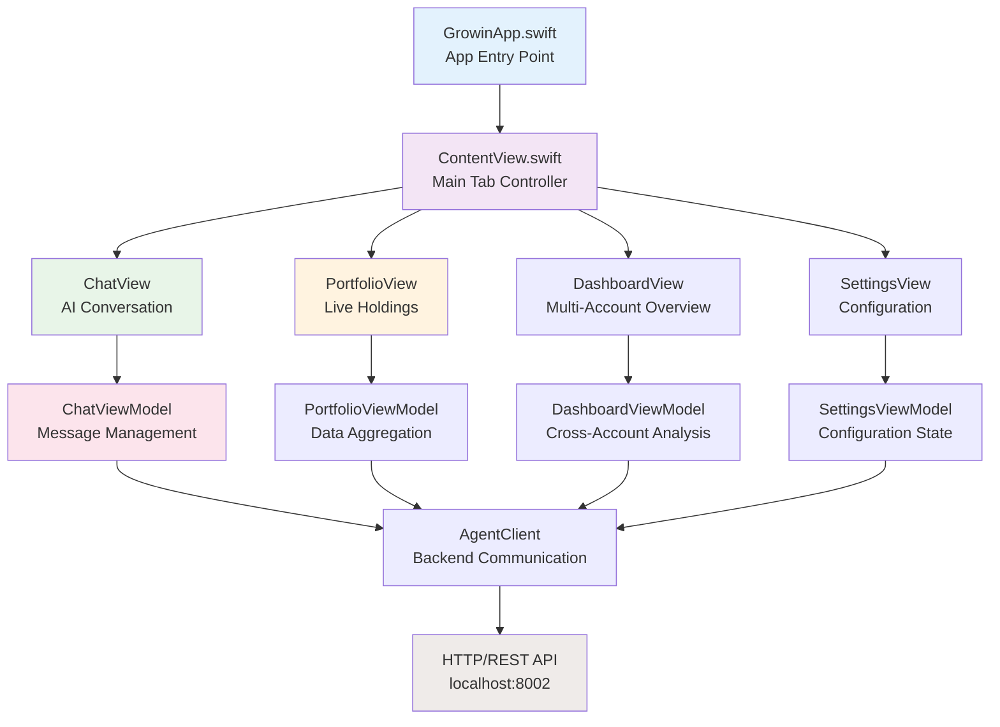

# Growin Architecture: Comprehensive AI-Powered Portfolio Intelligence Platform

## Executive Summary

**Growin** is a sophisticated financial intelligence platform that combines advanced artificial intelligence with real-time market data to provide intelligent portfolio analysis, automated trading insights, and conversational financial advice. In 2026, it adheres to SOTA best practices for **Agentic Autonomy**, **Financial Precision**, and **Local Inference**.

### System Vision
To democratize sophisticated financial analysis by providing retail investors with institutional-grade portfolio intelligence through an intuitive, AI-powered macOS application optimized for Apple Silicon hardware.

---

## 1. System Context & High-Level Architecture

### System Context Diagram

---

## 2. Financial Precision Layer (2026 SOTA)
To eliminate "one-cent drift" and binary floating-point errors common in financial apps, Growin implements a dedicated Precision Layer.

- **Engine**: All monetary calculations use Python `decimal.Decimal`.
- **Initialization**: Decimals are initialized exclusively from string representations to avoid implicit float conversion.
- **Rounding**: Standardized on `ROUND_HALF_UP` (Commercial Rounding).
- **Scale**: Intermediate calculations use 4 decimal places; display outputs are quantized to 2 places (`0.01`).
- **Validation**: Every price fetch is verified across multiple sources (Alpaca, yFinance, T212) with a `0.5%` variance threshold.

---

## 3. Agentic Reasoning & Collaborative Debate
Instead of a single "Chain of Thought," Growin uses a **Multi-Agent Debate Model**.

### The Debate Phase
1.  **Specialist Analysis**: The Swarm executes in parallel (e.g., `QuantAgent` finds a bullish pattern, while `ResearchAgent` finds negative earnings news).
2.  **Contradiction Identification**: The **Decision Moderator** identifies conflicting signals.
3.  **Synthesis**: The LLM reconciles these signals (e.g., "The technical breakout is strong, but the macro sentiment suggests a trap; recommend caution").

### Structured Telemetry
Every reasoning chain is traceable via **TelemetryData**:
- **Correlation ID**: Links every specialist output to the final user response.
- **Latency Tracking**: High-precision timing for every agent hop.
- **Reasoning Trace**: The `MarketContext` accumulates full agent rationale for auditability.

---

## 4. Frontend Architecture

### Application Structure

---

## 5. Security Enclave & Agent Sandboxing
As AI agents move toward autonomy, the **Sentinel Security Layer** provides robust guardrails.

### Safe Code Execution
- **Current**: `SafePythonExecutor` uses AST analysis and restricted builtins to execute model-generated "fixes".
- **Roadmap**: Migration to **Docker-based Isolation** via Docker MCP for 2026 SOTA agent safety.
  
---

## 6. Deployment & Operations

### Deployment Architecture

---

## 7. Testing Architecture

### Test Pyramid Implementation

*Note: Special emphasis is placed on **Financial Precision Tests** to ensure zero regression in Decimal math.*
